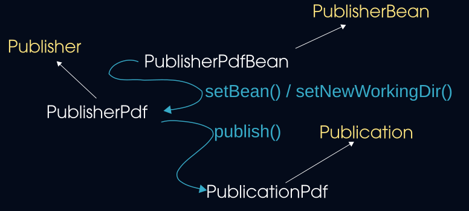
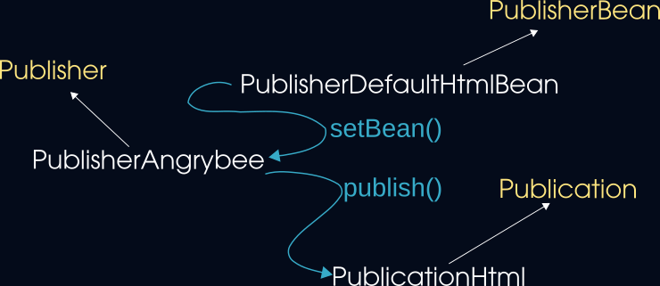

# website-publisher

`website-publisher` is a Java library to convert any Markdown content into: HTML or PDF.


# Markdown to HTML

To convert Markdown to HTML, you must use:

- `PublisherDefaultHtml` and its publish() method to process the conversion

- `PublisherDefaultHtmlBean` to aggregate all the parameters, required or optional, to launch the conversion

- `PublicationHtml` to store the result of the conversion process (here HTML file)

- The library contains a **default HTML template** called `default-template.html` in `src/main/resources` but you can use your own called of by `PublisherDefaultHtmlBean` methods:
  
  - `setTemplate()` to add your own HTML template
  
  - `setCss()` to add your own CSS files references
  
  - `setJs()` to add your own Javascript files references

See the following illustration:


Here is an example of default usage. 

>  NB: Javadoc contains detailed information and example of usage. Do not hesitate to check JUnit code also...

```java
//Initiliaze the Bean (to store parameters)
PublisherDefaultHtml pDefault = new PublisherDefaultHtml();
//Initialize the class performing the conversion
PublisherDefaultHtmlBean pDefaultBean = new PublisherDefaultHtmlBean();

//Load the Markdown to convert (Mandatory)
try {
     pDefaultBean.setMarkdown(FileUtils.getStrContent(new FileUtils().getFileFromResource("publish-markdown-input.md")));
} catch (URISyntaxException e) {
     e.printStackTrace();
}
//Add the additional information you want (only the Markdown is mandatory)
pDefaultBean.setAuthor("Charles Vissol");//Option
pDefaultBean.setDate("February 13, 2023");//Option
pDefaultBean.setTitleTxt("Linux Basics: Terminal survivor kit");//Option
pDefaultBean.setTitleImg("Linux_1_intro_terminal.png");//Option
//Set information in meta tags
pDefaultBean.setMetaAuthor("Charles Vissol");//Option
pDefaultBean.setMetaDescription("Linux Basics article. Introduction to Linux basic shortcuts to know the minimum to use the Terminal");//Option
pDefaultBean.setMetaKeywords("Linux terminal shortcut command basics introduction");//Option
pDefaultBean.setMetaIcon("../pictures/angrybee-blue.svg");//Option

//Add the Bean and all its parameters to the conversion process
pDefault.setBean(pDefaultBean);
//Execute the conversion and get the result
PublicationHtml htmlPub = (PublicationHtml) pDefault.publish();
//Displays HTML result as String
System.out.println(htmlPub.html());
```

# Markdown to PDF

> This publishing process requires a temporary directory available. Some kind of Files.createTempDirectory() support.

 To convert Markdown to PDF, you must use:

- `PublisherPdf` and its publish() method to process the conversion

- `PublisherPdfBean` to aggregate all the optional and required parameters to launch the conversion

- `PublicationPdf` to store the result of the conversion process (here PDF files)

- The library contains a default HTML template called `default-pdf-template.html` in `src/main/resources` but you can use your own called of by `PublisherPdfBean` method `setTemplate()`

> NB: The conversion from Markdown to PDF uses an intermediate format in HTML and CSS to customize the style of the PDF. 

See the following illustration:



> NB: The conversion to PDF requires a working directoy contrary to HTML conversion which is full In-Memory process

## Default PDF

Here is an example of default PDF conversion:

```java
PublisherPdfBean pDefaultBean = new PublisherPdfBean();
//Option: Creates the title of the PDF 
pDefaultBean.setTitleTxt("Template PDF Formatting article");
//Opetion: Sets the author and date of publication of the PDF
pDefaultBean.setAuthor("Charles Vissol");
pDefaultBean.setDate("February 20, 2023");
//Option: Add header to each page
pDefaultBean.setHeader("Header of the page");
//Option: add footer to each page
pDefaultBean.setFooter("This is a very long footer of page...");
//Mandatory: Input file in Makdown
pDefaultBean.setMarkdown("my-article.md");

PublisherPdf pDefault = new PublisherPdf();
pDefault.setBean(pDefaultBean);

PublicationPdf pdfResult = (PublicationPdf) pDefault.publish();
```

- First page sample result:


- Table of content page result:


- Page sample result:


## PDF with watermark

If you want to add a watermark to each page of the PDF, simply add the following code:

```java
pDefaultBean.setWatermark("Watermark!!!");
```

- Page with watermark sample result:


## Encrypted PDF

The encrypted PDF is always generated in addition to default PDF:

- with default owner and user passwords automatically and randomly generated by the library if not set in `PublisherPdfBean` object by `setOwnerPassword()` and `setUserPassword()` methods

- with specific owner and user passwords if set in `PublisherPdfBean` object by `setOwnerPassword()` and `setUserPassword()` methods

# Templates

By default the library contains several HTML and CSS templates to convert Markdown with a predefined style to HTML or PDF:

- `src/main/resources/default-template.html` is the default template to convert Markdwon to basic HTML

- `src/main/resources/default-pdf-template.html` is the default template to convert Markdown to PDF (the intermediate format to produce PDF is an HTML file)

- `src/main/resources/angrybee-template.html` is a specific template to produce https://angrybee.tech website pages.

If you want, you can create your own template and call it using `setTemplate()` of the beans.

# Dependencies

The library uses a set of depencies as you can see in `pom.xml`.

Mainly, it depends on:

- `PDFBox`

- `OpenHtmlToPdf`

- `JSoup`

- `Flexmark`

- `Jackson`

The pom.xml is designed to publish the full SBOM (Software Bill of Material) with `CycloneDx` and produces additional reports such as Code coverage or javadoc with syntax coloring.

You can find all details in `pom.xml`.

# Utility classes

The library contains some utiliity classes you can call directly:

- `Md2Html`: allows you to directly convert Markdown to HTML without style by calling:

```bash
java org.angrybee.website.publish.utils.Md2Html $input-markdown $output-html
```

- `PasswordGenerator`: allows to directly generate a password

```bash
java org.angrybee.website.publish.utils.PasswordGenerator $password-length
```

- `PDFProtectUtils`: allows you to directly encrypt a PDF in command line

```bash
java org.angrybee.website.publish.utils.PDFProtectUtils $input-pdf $output-pdf $owner-password $user-password
```

- `PDFWatermarkUtils`: allows you to directly add watermark to all pages of a PDF

```bash
java org.angrybee.website.publish.utils.PDFWatermarkUtils $input-pdf $output-pdf $watermark-text
```

# The Angrybee publication process

Initially, the library has been designed to convert my Markdown articles into web pages for my https://angrybee.tech website.

From Markdown, I generate HTML pages with:

- syntax coloring

- copy/paste code icon

- table of content automatically generated and synchronized with content navigation

- animations around `<section>` tags

Like HTML and PDF conversion, this process is made of 3 classes:

- `PublisherAngrybee`: main class that performs to conversion process in publish() method.

- `PublisherDefaultHtmlBean`: `PublisherAngrybee` uses `PublisherDefaultHtmlBean` parameters to perform the conversion

- `PublicationHtml`: result of the conversion process

The illustration of the process is here:



Illustration of a generated Angrybee web page:


# How to extend?

You can easily extend the capabilities of this library:

- without Java coding, by simply creating your own HTML and CSS templates you can modify the style produced by PublisherDefaultHtml or PublisherPdf. You need only to run `getTemplate()` method to inform the library that you want to use your own style

Here an illustration of style customization:


- with Java coding by implementing the following interfaces:
  
  - `Publisher`: interface to extend when you want to code a specific process of conversion inside the `publish()` method
  
  - `PublisherBean`: Interface to extend to store input parameters of the conversion process
  
  - `Publication`: interface representing the result of the conversion process

Here an illustration of a custom publication process:


The `$Custom` variable is corresponding to your own implementation and allows you to write your own process of publication using `JSoup`, `OpenHtmlToPdf`, `PDFBox`, etc.

# SonarQube quality review for release 1.0


