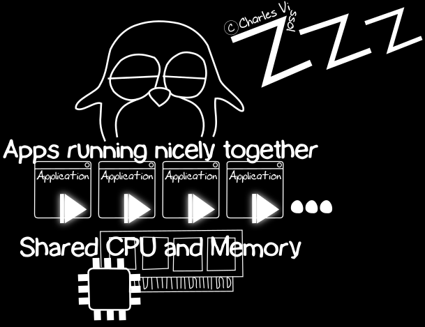
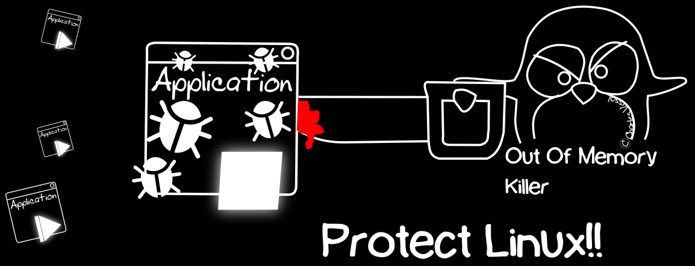
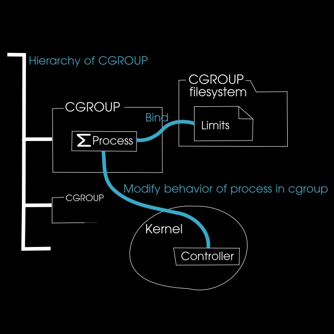
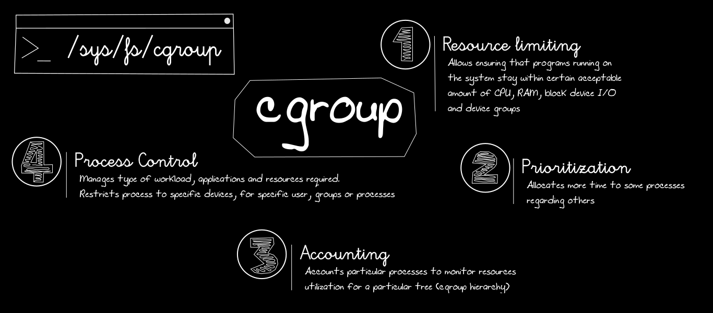
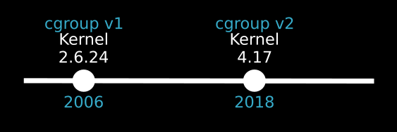
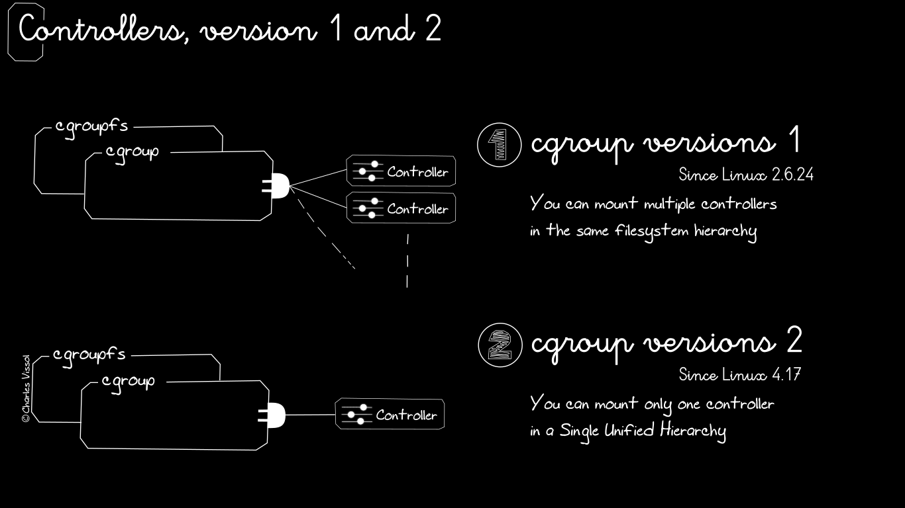
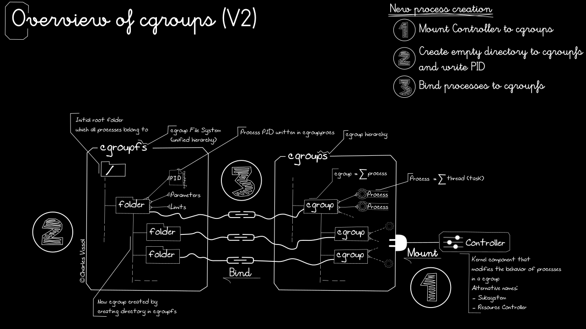
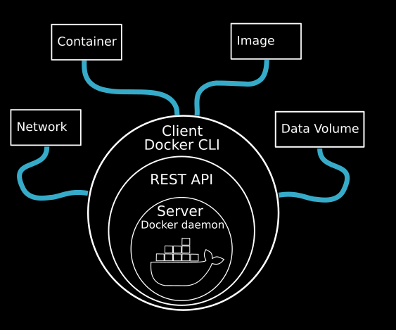

This book tries to explain in details the cgroup (control group) design. 

Because Debian is a `systemd` operating system, we describe `systemd` combined with cgroup.

At the end of the article we focus on cgroup version 2 with practical commands.

# Introduction

Generally an OS such as Linux has to divide its resources among all of the applications running on it.



But, if applications play usually nicely together, sometimes, a buggy application could consume all the available resources.


In this case, the last line of defense for the Linux kernel before crashing is the Out Of Memory (OOM) Killer process: it stops the application to free up enough resources.

Control group represents a Linux kernel design and an implementation to control resources usage and avoid this situation.



>  **Important**
> 
> To fine-graine the management, Linux Kernel has the ability to determine which application cannot consume too much: `cgroup` is a facility built into the Kernel that allows administrators first to track resources consumption but also to account and limit resources utilization by process (CPU, memory, network disk I/O).

# What is cgroup?

> **Definition**
> 
> *From Kernel Documentation*
> 
> "**cgroup** stands for **control group** and is never capitalized"
> 
> "The singular form is used to designate the whole feature and also as a qualifier as in **cgroup controllers**"
> 
> "When explicitly reffering to multiple individual control groups, the plural form **cgroups** is used"
> 
> "cgroup is a mechanism to organize processes hierarchically and distribute system resources along the hierarchy in a controlled and configurable manner"

cgroup is made of 3 parts:

- **cgroup**: collection of processes bound to parameters for one (cgroup version 2) or more subsystems (cgroups version 1),

- **subsystem (controller)**: kernel component called **resource controller** or **controller**. The controllers are various types and are able to:
  
  - limit CPU time on cgroup processes,
  
  - limit memory available on cgroup processes,
  
  - account of CPU time on cgroup processes,
  
  - freeze execution on cgroup processes,
  
  - resume execution on cgroup processes,

- **hierarchy**: set of cgroups arranged in tree.

cgroup is bound with controllers and a virtual filesystem (exists only in memory at runtime).

Here is the simplified architecture of cgroup:



The filesystem contains parameters to limit processes. The parameters are related to the elected controllers applicable to the processes.

Basically, cgroup is designed to track processes but with additional controllers, it can account and limit resources the cgroup can access.

> **Information**
> 
> cgroup v1 distinguishes **processes** from **tasks**. A process consists of multiple tasks (more commonly called threads). In cgroup v2, there is only **processes**.

cgroup is particularly important nowadays because servers are multi-cores CPUs and full of memory: a server can now run multiple services, multiple virtual machines, multiple containers, and multiple user accounts all at the same time.

# Main features of cgroup

`cgroup` provides control on:

- **Resources limiting**: 
  - number of CPU shared per process.
  - limits on memory per process.
  - Block Device I/O per process (See `udev` details at the end of the article).
  - Which network packets are identified as the same type (another application can enforce network traffic rules),
  - ...
- **Prioritization**: allocates to some processes more time on the system compared to others,
- **Accounting**: Accounts particular processes to monitor resources utilization for a particular tree (cgroup hierarchy: you can see what processes inside of which cgroup are consuming which types or resources),
- **Processes control**: controls workload, applications and resources required. Restricts processes to specific devices, for specific users, groups or processes,



In one sentence, you can use control groups to set limits, prioritize or isolate the hardware resources of processes. It allows you to control accuratly resource usage of applications to utilize them more efficiently.

# cgroup evolution

`cgroup` is part of the kernel design to enable you organizing processes into hierarchically ordered groups. This hierarchy (control groups tree) is defined into a cgroup virtual filesystem, mounted by default at `/sys/fs/cgroup/` directory. The `cgroup` virtual filesystem is loaded at runtime and disappears once system shutdowns.

cgroup exists in 2 versions: 

- version 1 (designed by Google, starting in 2006, since Linux kernel **2.6.24**),

- version 2 (since Linux kernel **4.17**).



In recent `systemd` distros, `systemd` automatically mount the `cgroupfs` version 2 at `/sys/fs/cgroup` during the boot process. `systemd` and service manager utilize `cgroup` to organize all units and services.

You can also manage manually `cgroup` hierarchies by creating / removing your own sub-directories inside `/sys/fs/cgroup` directory.

# Controllers evolution

The main difference beetwen v1 and v2 `cgroup` is about the Controllers: in v1, each Controller could be in a separate hierarchy. In v2, this is not possible.

Also, `cgroup` v1 and v2 controllers are not the same.



# The importance of cgroup...

`cgroup` is the foundation (with namespace) for containers technology, included in any modern Linux OS

Who is using cgroup?

- systemd

- OpenVZ

- YARN (Hadoop)

- LXC

- rkt

- Docker (libcontainer)

- Podman

- runc

- Tupperware (FB)

- ...

So... using containers, you are implementing `cgroup` by default. However, because `cgroup` is part of the Linux design, a system administrator can, without diving in containers technologies:

- manage the type of workloads, the applications and the resources they require,

- enhance security because default Linux systems use `cgroup` but does not put any restrictions upon processes. As system administrator, you can restrict access to specific devices for specific users, groups, or processes to help lock down a system.

- tune performance through `cgroup`

> **Information**
> 
> Docker Engine supports `cgroup` v2 since version 20.10.6 (2021-04-12) before, only `cgroup` v1 was supported

> **Important**
> 
> Note also that there is notable differences between Linux and Windows regarding containerization. Windows does not implement `cgroup` and `namespace` in its design.
> 
> See details at the end of the article.

# systemd Linux with cgroups

In this article, we focus on `systemd` and `cgroup` because Debian 11 is a `systemd` based OS but also because it uses by default `cgroup` version 2.

Despite the version 2 of `cgroup`, we cover `cgroups` version 1 and `cgroup` version 2.

## What is systemd?

`systemd` is a system and service manager for Linux operating systems. When it runs as first process on boot (as PID 1), it acts as init system that brings up and maintains userspace services. Separate instances are started for logged-in users to start their services.

`systemd` is usually not invoked directly by the user, but is started during early boot.

The user manager instances are started automatically through the [user@.service](https://www.man7.org/linux/man-pages/man5/user@.service.5.html) service.

`systemd` provides a number of interfaces used to create & manage labelled groups of processes for monitoring and controlling them and their resource usage.

As a consequence, the main cgroup tree becomes private property of that userspace 
component and is no longer a shared resource. On `systemd` systems PID 1 takes this role and hence needs to provide APIs for clients to take benefit of the control groups functionality of the kernel.

Note that services running on `systemd` systems may manage their own subtrees of the cgroup tree, as long as they explicitly turn on delegation mode for them.

`systemd` has 2 categories of instances:

- When run as a **system instance**, systemd interprets the configuration file `/etc/systemd/system.conf` and the files in `/etc/systemd/system.conf.d` directory;

See [systemd-system.conf](https://www.man7.org/linux/man-pages/man5/systemd-system.conf.5.html) for more information.

- When run as a **user instance**, systemd interprets the configuration file `~/.config/systemd/user.conf` and the files in `/etc/systemd/user.conf.d` directory.

`systemd` provides a dependency system between various entities called "units" of 11 different types. Units encapsulate various objects that are relevant for system boot-up and maintenance. The majority of units are configured in unit configuration files (See [systemd.unit](https://www.man7.org/linux/man-pages/man5/systemd.unit.5.html) for syntax details)

The 11 unit types are:

1. `.service` units, which start and control daemons and the processes they consist of. For details, see [systemd.service(5)](https://www.man7.org/linux/man-pages/man5/systemd.service.5.html).

2. `.socket` units, which encapsulates local IPC (Inter-Process Call) or network sockets in the system, useful for socket-based activation. For details about socket units, see [systemd.socket(5)](https://www.man7.org/linux/man-pages/man5/systemd.socket.5.html) and for details on socket-based activation and other forms of activation, see [daemon(7)](https://www.man7.org/linux/man-pages/man7/daemon.7.html).

3. `.target` units are useful to group units, or provide well-known synchronization points during boot-up, see [systemd.target(5)](https://www.man7.org/linux/man-pages/man5/systemd.target.5.html).

4. `.device` units expose kernel devices in systemd and may be used to implement device-based activation. For details, see [systemd.device(5)](https://www.man7.org/linux/man-pages/man5/systemd.device.5.html).

5. `.mount` units control mount points in the file system, for details see [systemd.mount(5)](https://www.man7.org/linux/man-pages/man5/systemd.mount.5.html).

6. `.automount` units provide automount capabilities, for on-demand mounting of file systems as well as parallelized boot-up. See [systemd.automount(5)](https://www.man7.org/linux/man-pages/man5/systemd.automount.5.html).

7. `.timer` units are useful for triggering activation of other units based on timers. You may find details in [systemd.timer(5)](https://www.man7.org/linux/man-pages/man5/systemd.timer.5.html).

8. `.swap` units are very similar to mount units and encapsulate memory swap partitions or files of the operating system. They are described in [systemd.swap(5)](https://www.man7.org/linux/man-pages/man5/systemd.swap.5.html).

9. `.path` units may be used to activate other services when file system objects change or are modified. See [systemd.path(5)](https://www.man7.org/linux/man-pages/man5/systemd.path.5.html).

10. `.slice` units may be used to group units which manage system processes (such as service and scope units) in a hierarchical tree for resource management purposes. See [systemd.slice(5)](https://www.man7.org/linux/man-pages/man5/systemd.slice.5.html).

11. `.scope` units are similar to service units, but manage foreign processes instead of starting them as well. See [systemd.scope(5)](https://www.man7.org/linux/man-pages/man5/systemd.scope.5.html). Units are named as their configuration files. Some units have special semantics. A detailed list is available in [systemd.special(7)](https://www.man7.org/linux/man-pages/man7/systemd.special.7.html).

## cgroup & systemd

cgroup is a technology independent from `systemd`. cgroup has been invented (by Google) one year before `systemd` (invented by Red Hat).

Today, cgroup is enabled by default with `systemd` and cgroup Version 2 is enabled by default in enterprise grade Linux systems.

> **Information:**
> 
> Fedora, Arch, Ubuntu 21.10+, and Debian 11 are the only Linux distros that run cgroups Version 2 by default at this date. However, many container technologies still in version 1.

More accuratly, `systemd` is built on top of kernel's cgroup API that requires that each individual cgroup is managed by a single writer only.

By default, `systemd` creates a new cgroup under the `system.slice` for each service it monitors.

You can change this behavior by editing the `systemd` service file. 
There are three options with regards to cgroup management with `systemd`:

- Editing the service file itself.
- Using drop-in files.
- Using `systemctl set-property` commands, which are the same as manually editing the files, but `systemctl` creates the required entries for you.

More at https://www.redhat.com/sysadmin/cgroups-part-four

## Why cgroup is important?

Nowadays, servers come with one or more multi-core CPUs and quantity of memory. Resource management on these "monsters" is more important than it was in old systems because a server can run multiple services, multiple virtual machine, multiple containers and multiple user accounts in the same time.

This situation requires more powerful tools to ensure that all these processes and users play nicely. Here is the purpose of cgroup!

## What can do an administrator with cgroup?

- Manage resource usage by either processes or users.
- Keep track of resource usage by users on multi-tenant systems to provide accurate billing.
- More easily isolate running processes from each other. This not only makes for better security but also allows us to have better containerization technologies than we had previously.
- Run servers that are densely packed with virtual machines and containers due to better resource management and process isolation.
- Enhance performance by ensuring that processes always run on the same CPU core or set of CPU cores, instead of allowing the Linux kernel to move them around to different cores.
- Whitelist or blacklist hardware devices.
- Set up network traffic shaping.

## Structure of cgroups version 1

Some definitions... to link to [systemd in details](##systemd in details) `systemd` units:

> **Definition: services** `.service`
> 
> Groups of processes that are started by systemd, and that are configured by the different unit configuration files. The individual processes in a service are started and stopped as one set.

> **Definition: scopes** `.scope`
> 
> Group of processes that are started by some external means. Virtual machines, containers, and user sessions are examples of scopes.

> **Definition: slices** `.slice`
> 
> A slice does not contain any processes. It's a group of hierarchically organized units. A slice manages processes that are running in either **scopes** or **services**. The four default slices are as follows:
> 
> - `-.slice`: root slice, which is the root of the whole slice hierarchy. Normally, it won't directly contain any other units. However, you can use it to create default settings for the entire slice tree.
> 
> - `system.slice`: system services that have been started by systemd.
> 
> - `user.slice`: user-mode services. An implicit slice is assigned to each logged-in user.
> 
> - `machine.slice`: services dedicated to running containers or virtual machines.

> **Important**
> 
> An administrator can define custom slices and assign scopes and services to them.

To see graphical representation of these processes, run the command `systemd-cgls`:

```bash
systemd-cgls
```

The output in Debian 11.4 should be like (unchanged for version 1 and version 2:

```bash
Control group /:
-.slice
├─user.slice 
│ └─user-1000.slice 
│   ├─user@1000.service 
│   │ ├─background.slice 
│   │ │ └─plasma-kglobalaccel.service 
│   │ │   └─1977 /usr/bin/kglobalaccel5
│   │ ├─app.slice 
│   │ │ ├─app-org.kde.kate-b498c13a5e274a0c882c324e5d1f72f7.scope 
│   │ │ │ └─38353 /usr/bin/kate -b /home/vissol/Downloads/linux-5.19-rc8/Documentation/vm/numa.rst
│   │ │ ├─app-org.kde.kate-bd04ec663c48458388b9fa5763b21475.scope 
│   │ │ │ └─36045 /usr/bin/kate -b /home/vissol/Downloads/linux-5.19-rc8/Documentation/admin-guide/tainted-kernels.rst
│   │ │ ├─app-org.kde.kate-701de1e0f47c4040b04c2b14b0736814.scope 
│   │ │ │ └─36107 /usr/bin/kate -b /home/vissol/Downloads/linux-5.19-rc8/Documentation/admin-guide/perf-security.rst
│   │ │ ├─xdg-permission-store.service 
│   │ │ │ └─1877 /usr/libexec/xdg-permission-store
│   │ │ ├─app-\x2fusr\x2fbin\x2fkorgac-fba6fc922f304fd892acdbd09d5c57e6.scope 
│   │ │ │ └─2059 /usr/bin/korgac -session 10dfd7e29f000165373856000000016460011_1659082942_32052
│   │ │ ├─xdg-document-portal.service 
│   │ │ │ ├─1873 /usr/libexec/xdg-document-portal
│   │ │ │ └─1883 fusermount -o rw,nosuid,nodev,fsname=portal,auto_unmount,subtype=portal -- /run/user/1000/doc
│   │ │ ├─app-org.kde.kate-3c8915e087fd4680ba5fed65f42a4f88.scope 
│   │ │ │ └─36427 /usr/bin/kate -b /home/vissol/Downloads/linux-5.19-rc8/Documentation/admin-guide/sysctl/vm.rst
│   │ │ ├─app-org.kde.kate-1a49d3c474e34ad283440d3d1298394a.scope 
│   │ │ │ └─36893 /usr/bin/kate -b /home/vissol/Downloads/linux-5.19-rc8/Documentation/admin-guide/laptops/laptop-mode.rst
│   │ │ ├─xdg-desktop-portal.service 
│   │ │ │ └─1864 /usr/libexec/xdg-desktop-portal
│   │ │ ├─app-org.kde.kate-2b0ef5011a5344989296587e17dde86e.scope 
[lines 1-29]
```

> **Information**
> 
> On any desktop machine, you'll always have a lot more running services than you'd have on a strictly text-mode machine.

The first cgroup is `/` cgroup, which is the root cgroup. The second line begins the listing for the root slice (`-.slice`) with a direct child `user.slice` and next `user-1000.slice`. Here `1000` corresponds to my User ID.

> **Important**
> 
> To see user slices, you need to run `systemd-cgls` outside of the cgroup filesystem. The more you dive into `/sys/fs/cgroup` filesystem, the less you see with `systemd-cgls`.

### user.slice

The `user.slice` is defined by the `/lib/systemd/system/user.slice` unit file, which looks like:

```bash
[Unit]
Description=User and Session Slice
Documentation=man:systemd.special(7)
Before=slices.target
```

This slice has to finish starting before `slices.target` (in the same directory than `user.slice`) which contains:

```bash
[Unit]
Description=Slices
Documentation=man:systemd.special(7)
Wants=-.slice system.slice
After=-.slice system.slice
```

`slices.target` is responsible for setting up the slices that run when you boot up your machine: by default, it starts up `system.slice` and the root slice ( `-.slice` ) as we can see in `Wants` and `After` parameters.

> **Important**
> 
> We can add more slices to the current list in `user.slice` and `slices.target`.

At the same level than `user.slice`, we have `init.scope` and `system.slice`:

```bash
-.slice
├─user.slice 
. . .
├─init.scope
. . .
├─system.slice
│. . .
```

### user-1000.slice

The first child of `user-1000.slice` is `user@1000.slice`. `user@1000.slice` is responsible for all services running in `1000` user's slice and is set up by `user@.service` template (in `/lib/systemd/system/user@.service`).

The `user@.service` template has 2 sections:

- `[Unit]`

```bash
[Unit]
Description=User Manager for UID %i
Documentation=man:user@.service(5)
After=systemd-user-sessions.service user-runtime-dir@%i.service dbus.service
Requires=user-runtime-dir@%i.service
IgnoreOnIsolate=yes
```

- `[Service]`

```bash
[Service]
User=%i
PAMName=systemd-user
Type=notify
ExecStart=/lib/systemd/systemd --user
Slice=user-%i.slice
KillMode=mixed
Delegate=pids memory
TasksMax=infinity
TimeoutStopSec=120s
KeyringMode=inherit
```

> **Important**
> 
> At running time, the `%i` is replaced by the user ID number.

Let's see some interesting clauses of [Service] section:

- `ExecStart`: systemd starts a new systemd session for each user who logs in

- `Slice`: create a separate slice for each user

- `TaskMax`: Limit or not the number of processes. Here `infinity` means there is no limits

- `Delegate`: Allows delegation for controllers listed here, means `pids` and `memory`

All services running in `1000` user's slice are children of the `user@1000.service`. In this tree, we can see also scope corresponding to user's local programs execution

```bash
systemd-cgls | grep scope
│   │ │ ├─app-gnome\x2dtodo-c8bbb1ea42124e4eabe95eca8c02e5f7.scope 
│   │ │ ├─app-google\x2dchrome-fa92ae1ce8f54f4298975211065460e7.scope 
│   │ │ ├─app-protonvpn-8065209d48094182b0b0c0352d51cd10.scope 
│   │ │ ├─app-org.kde.konsole-de12e69356754c5dae23bdfdc108d53a.scope 
│   │ │ │ └─44710 grep scope
│   │ │ ├─app-firefox\x2desr-73828cd3b1754ee0b4ffafdd6750507d.scope 
│   │ │ ├─app-\x2fusr\x2flib\x2fx86_64\x2dlinux\x2dgnu\x2flibexec\x2fDiscoverNotifier-72a3c7b93c0947d5bbcf6c3beee4e003.scope 
│   │ │ ├─app-marktext-d9ed06b1e1724ec482580148c7aa057c.scope 
│   │ │ ├─app-\x2fusr\x2fbin\x2fkorgac-9e6550aaf81c4723a7afd6ba45888d14.scope 
│   │ └─init.scope 
│   └─session-3.scope 
├─init.scope
```

> **Information**
> 
> Local terminal session is designated by `session-2.scope`
> 
> Remote terminal session is designated by `session-3.scope`
> 
> Here the terminal session is hosted by `konsole`, the KDE terminal program

> **Important**
> 
> `.scope` are only created programmatically at runtime (not created using unit files). So you can't expect to see any `.scope` files in `/lib/systemd/system/` directory.

### machine.slice

In my configuration, Podman is running (`libpod` is `podman-docker` container) and we can see `machine.slice` representation like this:

```bash
. . .
└─machine.slice
  └─libpod-cc06c35f21cedd4d2384cf2c048f013748e84cabdc594b110a8c8529173f4c81.sco>
    ├─1438 apache2 -DFOREGROUND
    ├─1560 apache2 -DFOREGROUND
    ├─1561 apache2 -DFOREGROUND
    ├─1562 apache2 -DFOREGROUND
    ├─1563 apache2 -DFOREGROUND
    └─1564 apache2 -DFOREGROUND
```

### Managing treeview of systemd processes

When `systemd-cgls` is running without parameters, it returns the entire cgroup hierarchy. The highest level of the cgroup tree is formed by slices and can look as follows:

```bash
├─system
│ ├─1 /usr/lib/systemd/systemd --switched-root --system --deserialize 20  
│ ...
│      
├─user
│ ├─user-1000
│ │ └─ ...
│ ├─user-2000
│ │ └─ ...
│ ...
│     
└─machine  
  ├─machine-1000
  │ └─ ...
  ...
```

> **Information**
> 
> Note that machine slice is present only if you are running a virtual machine or a container.

To reduce the output of `systemd-cgls`, and to view a specified part of the hierarchy, execute:

```bash
$ systemd-cgls $NAME
```

`$NAME` is the resource controller you want to inspect

Example: `memory` controller

```bash
$ systemd-cgls memory
memory:
├─    1 /usr/lib/systemd/systemd --switched-root --system --deserialize 23
├─  475 /usr/lib/systemd/systemd-journald
[...]
```

> **Information**
> 
> `systemd` also provides the `machinectl` command dedicated to monitoring Linux containers.

> Information
> 
> Linux provides also systemctl to get the treview of processes using systemd units as parameter to filter queries with syntax: `systemctl status $systemd_unit`
> 
> Ex: `systemctl status user.slice`

## cgroups version 1 filesystem

cgroups version filesystem is in `/sys/fs/cgroup` virtual filesystem (only exists in memory and disappears when you shut down the machine.

In the `/sys/fs/cgroup`directory you see something like this:

```bash
blkio         
cpu -> cpu,cpuacct           
cpu,cpuacct         
cpuacct -> cpu,cpuacct
cpuset        
devices                      
freezer             
hugetlb    
memory        
net_cls -> net_cls,net_prio  
net_cls,net_prio    
net_prio -> net_cls,net_prio    
perf_event    
pids                         
rdma                
systemd    
unified
```

Each of these directories represents a cgroup resource controller (or susbsystem or controller).

Inside each of these directories is a set of files that represent the cgroup's *tunables*. These files hold information about any resource control or tuning parameters that you would set.

For example for `blkio`, you'll find:

```bash
blkio.bfq.io_service_bytes
blkio.bfq.io_service_bytes_recursive
blkio.bfq.io_serviced
blkio.bfq.io_serviced_recursive
blkio.reset_stats
blkio.throttle.io_service_bytes
blkio.throttle.io_service_bytes_recursive
blkio.throttle.io_serviced
blkio.throttle.io_serviced_recursive
blkio.throttle.read_bps_device
blkio.throttle.read_iops_device
blkio.throttle.write_bps_device
blkio.throttle.write_iops_device
cgroup.clone_children
cgroup.procs
cgroup.sne_behavior
init.scope
machine.slice
notify_on_release
release_agent
system.slice
tasks
user.slice
```

Each of these files represents a parameter that can be custom-tuned for the best performance. Toward the bottom, we also see directories for `init.scope`, `machine.slice`, `system.slice`, and `user.slice`. Each also has its own set of tunable parameters.

## Controlling resources usage with cgroups v1

### Resource controllers v1

For examining resource controllers of cgroups v1, you can install cgroup-tools:

```bash
sudo apt install cgroup-tools
```

Once installed, you can run `lssubsys` to view active resource controllers:

```bash
$ lssubsys
cpuset
cpu,cpuacct
blkio
memory
devices
freezer
net_cls,net_prio
perf_event
hugetlb
pids
rdma
```

In this case all resource controllers of cgroups v1 are active.

If you go to `/sys/fs/cgroup` directory, you can see that each of these resource controller has its own directory

```bash
$ ls /sys/fs/cgroup
blkio         cpu -> cpu,cpuacct           cpu,cpuacct         cpuacct -> cpu,cpuacct
cpuset        devices                      freezer             hugetlb    
memory        net_cls -> net_cls,net_prio  net_cls,net_prio    net_prio -> net_cls,net_prio    
perf_event    pids                         rdma                systemd    
unified
```

> **Information**
> 
> Ignore `systemd` and `unified`:
> 
> - `systemd` is for the root cgroup
> 
> - `unified` is for Version 2 controllers

There is 2 symbolic links with `cpu` and `cpuacct` controllers because these 2 separate controllers are now combined into one controller.

This is the same for `net_cls` and `net_prio` controllers.

Here we focus on 3 resources controllers: `cpu`, `memory`, `blkio` because they can be directly configured via `systemd`.

### Controlling CPU usage for a user

Imagine that you have in your system a user consuming 100% of your CPU. Imagine you have identified him by `systemd-cgls` command to get it's user number (let's give `1001` here).

If you want for example reduce drastically its CPU quotas usage to 10%, run:

```bash
sudo systemctl set-property user-1001.slice CPUQuota=10%
```

This command creates some new files in the `/etc/systemd` so you need to run:

```bash
sudo systemctl daemon-reload
```

...as you created a new unit file.

Once done, you can see that the user will be limited to 10% but... to explain more in details:

- For a 4 CPU cores system, defining a CPU quota to 10% means 2.5% per core for a total of 10% spread in 4 cores.

So if you allocate CPUQuota=100% in reality you allocate 25% by core in this case.

> **Information**
> 
> You can simulate CPU stress on a Linux system by installing `stress-ng`:
> 
> ```bash
> sudo apt install stress-ng
> ```
> 
> For 4 CPU core to stress you can run with `1001` user profile for example:
> 
> ```bash
> #1001 user stress 4 CPU cores
> stress-ng -c 4
> ```
> 
> In this case, `1001` user will take all the CPU resources because by default on Linux all users have unlimited use of the system resources

> **Important**
> 
> The first time you execute a `systemctl set-property` command, you'll create the `system.control` directory under the `/etc/systemd` directory, which looks like this:
> 
> ```bash
> vissol@debian:/etc/systemd$ ls -ld system.control/
> drwxr-xr-x 3 root root 4096 Jul 14 19:59 system.control/
> ```
> 
> Under this directory you can find `1001` user slice and under its user slice directory you can find the configurations files for its CPUQuota:
> 
> ```bash
> vissol@debian:/etc/systemd/system.control$ ls -l
> total 4
> drwxr-xr-x 2 root root 4096 Jul 14 20:25 user-1001.slice.d
> vissol@debian:/etc/systemd/system.control$ cd user-1001.slice.d/
> vissol@debian:/etc/systemd/system.control/user-1001.slice.d$ ls -l
> total 4
> -rw-r--r-- 1 root root 143 Jul 14 20:25 50-CPUQuota.conf
> vissol@debian:/etc/systemd/system.control/user-1001.slice.d$ cat 50-CPUQuota.conf 
> # This is a drop-in unit file extension, created via "systemctl set-property"
> # or an equivalent operation. Do not edit.
> [Slice]
> CPUQuota=10%
> ```
> 
> Now, be aware that you'll only need to do a `daemon-reload` when you first create this file. Any subsequent changes you make to this file with the `systemctl set-property` command will take effect immediately.
> 
> In the cgroup filesystem, under `1001` user slice directory, you'll see her current `CPUQuota` setting in the `cpu.cfs_quota_us` file. Here's what it looks like when set to `10%`:
> 
> ```bash
> vissol@debian:/sys/fs/cgroup/cpu/user.slice/user-1001.slice$ cat cpu.cfs_quota_us 
> 10000
> vissol@debian:/sys/fs/cgroup/cpu/user.slice/user-1001.slice$
> ```

### Controlling CPU usage for a service

To show how to control CPU for a service, we will create a specific service: `cputest.service` managed by root and reuse the `stress-ng` tool of previous chapter.

To create the service, run:

```bash
sudo systemctl edit --full --force cputest.service
```

It creates a file in `/usr/lib/systemd/system` and the content should look like this, assuming we have 4 CPU cores:

```bash
[Unit]
Description=CPU stress test service
[Service]
ExecStart=/usr/bin/stress-ng -c 4
```

Start the service:

```bash
vissol@debian:~$ sudo systemctl daemon-reload
vissol@debian:~$ sudo systemctl start cputest.service 
```

At this time, the service should take 100% CPU resources.

As made for a user, you can set a CPU quota to the service, for example 90% in this case by running:

```bash
sudo systemctl set-property cputest.service CPUQuota=90%
sudo systemctl daemon-reload
```

This command creates a directory in `/etc/systemd/system.control/`:

```bash
vissol@debian:/etc/systemd/system.control$ ls -l
total 8
drwxr-xr-x 2 root root 4096 Jul 15 19:15 cputest.service.d
drwxr-xr-x 2 root root 4096 Jul 15 17:53 user-1001.slice.d
```

Inside the `/etc/systemd/system.control/cputest.service.d/` directory, you'll see the `50-CPUQuota.conf` file:

```bash
vissol@debian:/etc/systemd/system.control/cputest.service.d$ cat 50-CPUQuota.conf 
# This is a drop-in unit file extension, created via "systemctl set-property"
# or an equivalent operation. Do not edit.
[Service]
CPUQuota=90%
```

This allows `cputest.service` to use only about 22.5% of each CPU core...remember last chapter...

In the cgroup filesystem, you can see the `CPUQuota` set to 90%:

```bash
vissol@debian:/sys/fs/cgroup/cpu/system.slice/cputest.service$ cat cpu.cfs_quota_us 
90000
```

> **Important**
> 
> This limit is only placed on the *service*, and not on the root user who owns the service. The root user can still run other programs and services without any limits.

Another way to limitate the CPU usage for this service is to directly specify the quota inside the service file:

```bash
#Stop the service
vissol@debian:~$ sudo systemctl stop cputest.service 
#delete the cputest.service.d/ directory that you created with the systemctl set-property command
vissol@debian:/etc/systemd/system.control$ sudo rm -rf cputest.service.d/
#reload service
vissol@debian:/etc/systemd/system.control$ sudo systemctl daemon-reload
# start cputest.service. 
vissol@debian:/etc/systemd/system.control$ sudo systemctl start cputest.service
```

Then stop the service and edit the unit file:

```bash
vissol@debian:~$ sudo systemctl edit --full cputest.service
```

Add the `CPUQuota=90%` line, so that the file now looks like this:

```bash
[Unit]
Description=CPU stress test service
[Service]
ExecStart=/usr/bin/stress-ng -c 4
CPUQuota=90%
```

Save the file and start the service.

### Controlling the memory usage for a user

Again, imagine a `1001` user running process that is using all the system memory.

You can simulate a high memory usage of your `1001` user  by running `stress-ng`:

```bash
stress-ng --brk 4
```

If you want to limitate `1001` user programs to 1GB max memory for example, run the following command and execute `daemon-reload`:

```bash
sudo systemctl set-property user-1001.slice MemoryLimit=1G
sudo systemctl daemon-reload
```

Like for CPU quota, this command creates specific file into `/etc/systemd/system.control/user-1001.slice.d`:

```bash
vissol@debian:/etc/systemd/system.control/user-1001.slice.d$ cat 50-MemoryLimit.conf 
# This is a drop-in unit file extension, created via "systemctl set-property"
# or an equivalent operation. Do not edit.
[Slice]
MemoryLimit=1073741824
```

> **Important**
> 
> If you want to create temporary modifications just add `--runtime` option:
> 
> ```bash
> sudo systemctl set-property --runtime user-1001.slice MemoryLimit=1G
> sudo systemctl daemon-reload
> ```
> 
> In this case, you loose your modifications when you reboot the system and it creates a temporary configuration file in the `/run/systemd/system.control/user-1001.slice.d/` directory, which looks like this:
> 
> ```bash
> vissol@debian:/etc/systemd/system.control/user-1001.slice.d$ cat 50-MemoryLimit.conf 
> # This is a drop-in unit file extension, created via "systemctl set-property"
> # or an equivalent operation. Do not edit.
> [Slice]
> MemoryLimit=1073741824
> ```

### Controlling the memory usage for a service

To get short, adding memory control to a service is close to user process. Execute the following command (here example of Apache2 service):

```bash
sudo systemctl set-property apache2.service MemoryLimit=1G
```

Then edit the Apache2 service file and in the section [Service], add the new parameter without double quotes:

```bash
[Service]
...
MemoryLimit=1G
```

Next, run `sudo systemctl daemon-reload`

### Controlling IO usage for a user

Controlling IO means controlling `blkio` controller.

> Information
> 
> To follow the usage of IO, you can install iotop:
> 
> ```bash
> sudo apt install iotop
> ```
> 
> `iotop` allows you to view live consumption of disk IO.

Imagine a `1001` user from whom you want to manage IO in a specific partition. To simulate this control, first let's create a dedicated partition with `dd` command with the `1001` user's profile:

```bash
vissol@debian:~$ dd if=/dev/zero of=afile bs=1M count=10000
10000+0 records in
10000+0 records out
10485760000 bytes (10 GB, 9.8 GiB) copied, 17.4288 s, 602 MB/s
```

We have created a 10GB file and next the user copies contents of file over the `/dev/null` device.

```bash
vissol@debian:~$ dd if=afile of=/dev/null
20480000+0 records in
20480000+0 records out
10485760000 bytes (10 GB, 9.8 GiB) copied, 69.2341 s, 151 MB/s
```

It appears that the user reads this file at an average rate of 151 MB per second.

First we have to know where the user reads the file:

```bash
vissol@debian:~$ lsblk
NAME                      MAJ:MIN RM   SIZE RO TYPE MOUNTPOINT
loop0                       7:0    0  99.4M  1 loop /snap/core/11316
. . .
. . .
sda                         8:0    0     1T  0 disk 
├─sda1                      8:1    0     1M  0 part 
├─sda2                      8:2    0     1G  0 part /boot
└─sda3                      8:3    0 930.5G  0 part  
  └─sda3_crypt            253:0    0 930.5G  0 crypt 
    ├─debian--vg-root   253:1    0  23.3G  0 lvm   /
    ├─debian--vg-var    253:2    0   9.3G  0 lvm   /var
    ├─debian--vg-swap_1 253:3    0   976M  0 lvm   [SWAP]
    ├─debian--vg-tmp    253:4    0   1.9G  0 lvm   /tmp
    └─debian--vg-home   253:5    0 895.1G  0 lvm   /home
sdb                         8:16   0    10G  0 disk 
└─sdb1                      8:17   0    10G  0 part /media/backup
sr0                        11:0    1  1024M  0 rom  
```

`1001` user has his own home directory. The `/home` directory is mounted as logical volume on the `/dev/sda3` drive.

Let's say we want to limitate bandwidth to 1MB, in this case we run the command:

```bash
sudo systemctl set-property user-1001.slice BlockIOReadBandwidth="/dev/sda3 1M"
sudo systemctl daemon-reload
```

In this case the system modification appears permanent by creating a new file in `/etc/systemd/system.control/user-1001.slice.d`:

```bash
vissol@debian:/etc/systemd/system.control/user-1001.slice.d$ cat 50-BlockIOReadBandwidth.conf 
# This is a drop-in unit file extension, created via "systemctl set-property"
# or an equivalent operation. Do not edit.
[Slice]
BlockIOReadBandwidth=1000000
```

Regarding cgroups the following file appears:

```bash
vissol@debian:/sys/fs/cgroup/blkio/user.slice/user-1001.slice$ cat blkio.throttle.read_bps_device 
8:0 1000000
```

In this `blkio.throttle.read_bps_device` file, the `8:0` represents the major and minor numbers of the `/dev/sda` device:

```bash
vissol@debian:/dev$ ls -l sda
brw-rw---- 1 root disk 8, 0 Oct  5 08:01 sda
```

### Controlling IO usage for a service

As for a user, you can control IO for a service using `BlockIOReadBandwidth` parameter for this service. Here example with Apache2 to control IO by command line:

```bash
sudo systemctl set-property apache2.service BlockIOReadBandwidth="/dev/sda 1M"
```

> **Warning**
> 
> If you want to set this `BlockIOReadBandwidth` parameter in a service file, you need to know that you had to surround the `/dev/sda 1M` part with a pair of double quotes. 
> 
> When you set this in a service file, you do **not** surround the `/dev/sda 1M` within double quotes.

Edit the Apache2 service file and in the section [Service], add the new parameter without  double quotes:

```bash
[Service]
. . .
.. .
BlockIOReadBandwidth=/dev/sda 1M
```

Next, run `sudo systemctl daemon-reload`

This modification must add the following file & values in cgroups filesystem:

```bash
vissol@debian:/sys/fs/cgroup/blkio/system.slice/vsftpd.service$ cat blkio.throttle.read_bps_device 
8:0 1000000
```

In this `blkio.throttle.read_bps_device` file, the `8:0` represents the major and minor numbers of the `/dev/sda` device as already said:

```bash
vissol@debian:/dev$ ls -l sda
brw-rw---- 1 root disk 8, 0 Oct  5 08:01 sda
```

### More about systemd resource control

If you want more parameters to control systemd via cgroups, run:

```bash
man systemd.resource-control
```

You display **all the parameter**s you can set to control users and services programs.

Just be careful of the **cgroups version supported** by your system.

### Exhaustive list of cgroups version 1 controllers

The following controllers are available for cgroup v1:

- `blkio`: Short for Block Input/Output. It allows to set limits on how fast processes and users can read from or write to block devices. (A block device is something such as a hard drive or a hard drive partition.)

- `cpu` , `cpuacct`: these controllers are combined into one single controller. This controller lets you control CPU usage for either processes or users. On a multi-tenant system, it allows you to monitor user's CPU usage.

- `cpuset`: In case of multiple CPU cores systems, this allows you to assign a process to one specific CPU core or a set of CPU cores. This enhances performance by forcing a process to use a portion of the CPU cache that's already been filled with the data and the instructions that the process needs. By default, the Linux kernel scheduler can move processes around from one CPU core to another, or from one set of CPU cores to another. Every time this happens, the running process must access the main system memory to refill the CPU cache. This costs extra CPU cycles, which can hurt performance.

- `devices`: it allows controlling access to system devices.

- `freezer`: It allows you to suspend running processes in a cgroup. This is interesting when you need to move a process from one cgroup to another.

- `memory`: it allows you to set limits on the amount of system memory that a process or a user can use. It generates automatic reports on memory resources used by those processes & users.

- `net_cls`, `net_prio`: it allows you to tag network packets with a class identifier (`classid`) that enables the Linux traffic controller & Linux firewalls (the `tc` command) to identify packets that originate from a particular process. This is useful to control and prioritize network traffic for various cgroups.

- `pids`: it can set a limit on the a number of processes that can run in a cgroup.

- `perf_event`: can group tasks for monitoring by the `perf` performance monitoring and reporting utility.

- `rdma`: Remote Direct Memory Access allows one computer to directly access the memory of another computer without having to involve either computer's operating system. This controller is mainly used for parallel computing clusters.

- `hugetlb`: allows you to limit the usage of huge memory pages by cgroup processes.

## Deprecated cgroups version 1 core features

- Multiple hierarchies including named ones are not supported.

- All v1 mount options are not supported.

- The “tasks” file is removed and `cgroup.procs` is not sorted.

- `cgroup.clone_children` is removed.

- `/proc/cgroups` is meaningless for v2. Use `cgroup.controllers` file
  at the root instead.

## Understanding cgroup version 2

cgroups version 1 has too many resource controllers and too many attributes per controller. 

Some unnecessary controllers have been removed from cgroup version 2.

Also, version 1 hierarchy is too much complex because each controller has its own subdirectory inside `/sys/fs/cgroup` filesystem.

Remember when you wanted to control `1001` user `CPUQuota`, `memory` and `BlockIOReadBandwidth`, you had 3 different locations:

```bash
#CPUQuota
/sys/fs/cgroup/cpu/user.slice/user-1001.slice/cpu.cfs_quota_us

#memory
/sys/fs/cgroup/memory/user.slice/user-1001.slice/memory.max_usage_in_bytes

#BlockIOReadBandwidth
/sys/fs/cgroup/blkio/user.slice/user-1001.slice/blkio.throttle.read_bps_device
```

Another problem with version 1 is that there is no consistency naming convention for the attribute files of the different resource controllers. For example `MemoryMax` value is in the `memory.max_usage_in_bytes` file but `CPUQuota` is in the `cpu.cfs_quota_us` file...

> **Important**
> 
> In Debian 11 **man systemd.resource-control**, le cgroup version 2 is refered as **unified control group hierarchy** by opposition to cgroups version 1.
> 
> Access the man page running `man systemd.resource-control`.

## Moving to cgroup version 2

To adopt cgroup version 2, you need a minimum of `systemd` v226 and a kernel v4.17.

If you system is compliant, to move to cgroup version 2, you first edit `/etc/default/grub` and add `systemd.unified_cgroup_hierarchy=1` to the line beginning with `GRUB_CMDLINE_LINUX=`.

In Debian 11.4 system that should be like:

```bash
GRUB_CMDLINE_LINUX="systemd.unified_cgroup_hierarchy=1"
```

Next, rebuild the `grub` configuration:

```bash
sudo grub2-mkconfig -o /boot/grub2/grub.cfg
```

Reboot the machine and execute the following command to know the cgroup version:

```bash
$ mount | grep cgroup
```

Output should be something like this:

```bash
cgroup2 on /sys/fs/cgroup type cgroup2 (rw,nosuid,nodev,noexec,relatime,nsdelegate,memory_recursiveprot)
```

> **Important**
> 
> At anytime you can return to cgroups version 1 by editing `/etc/default/grub` file and rebuilding `grub` configuration. 

## cgroup version 2 filesystem

The cgroup version 2 filesystem looks like this:

```bash
vissol@debian:~$ ls -l /sys/fs/cgroup
total 0
-r--r--r--  1 root root 0 Oct 10 12:48 cgroup.controllers
-rw-r--r--  1 root root 0 Oct 10 12:48 cgroup.max.depth
-rw-r--r--  1 root root 0 Oct 10 12:48 cgroup.max.descendants
-rw-r--r--  1 root root 0 Oct 10 12:48 cgroup.procs
-r--r--r--  1 root root 0 Oct 10 12:48 cgroup.stat
-rw-r--r--  1 root root 0 Oct 10 08:06 cgroup.subtree_control
-rw-r--r--  1 root root 0 Oct 10 12:48 cgroup.threads
-rw-r--r--  1 root root 0 Oct 10 12:48 cpu.pressure
-r--r--r--  1 root root 0 Oct 10 12:48 cpuset.cpus.effective
-r--r--r--  1 root root 0 Oct 10 12:48 cpuset.mems.effective
-r--r--r--  1 root root 0 Oct 10 12:48 cpu.stat
drwxr-xr-x  2 root root 0 Oct 10 08:06 dev-hugepages.mount
drwxr-xr-x  2 root root 0 Oct 10 08:06 dev-mqueue.mount
drwxr-xr-x  2 root root 0 Oct 10 12:48 init.scope
-rw-r--r--  1 root root 0 Oct 10 12:48 io.cost.model
-rw-r--r--  1 root root 0 Oct 10 12:48 io.cost.qos
-rw-r--r--  1 root root 0 Oct 10 12:48 io.pressure
-r--r--r--  1 root root 0 Oct 10 12:48 io.stat
-r--r--r--  1 root root 0 Oct 10 12:48 memory.numa_stat
-rw-r--r--  1 root root 0 Oct 10 12:48 memory.pressure
-r--r--r--  1 root root 0 Oct 10 12:48 memory.stat
drwxr-xr-x  2 root root 0 Oct 10 08:06 proc-sys-fs-binfmt_misc.mount
drwxr-xr-x  2 root root 0 Oct 10 08:06 sys-fs-fuse-connections.mount
drwxr-xr-x  2 root root 0 Oct 10 08:06 sys-kernel-config.mount
drwxr-xr-x  2 root root 0 Oct 10 08:06 sys-kernel-debug.mount
drwxr-xr-x  2 root root 0 Oct 10 08:06 sys-kernel-tracing.mount
drwxr-xr-x 46 root root 0 Oct 10 12:40 system.slice
drwxr-xr-x  3 root root 0 Oct 10 08:06 user.slice
```

The attribute files are global settings.

The interesting directories are `system.slice` and `user.slice`. Inside these directories, you can control all the resources for services and users.

Note that in `user.slice` directory you have the list of all `user@$ID.slice` where `$ID` is the identifier of the users.

Example for `1001` user:

```bash
vissol@debian:~$ ls -l /sys/fs/cgroup/user.slice/user-1001.slice
total 0
-r--r--r-- 1 root   root   0 Oct 10 14:30 cgroup.controllers
-r--r--r-- 1 root   root   0 Oct 10 08:06 cgroup.events
-rw-r--r-- 1 root   root   0 Oct 10 14:30 cgroup.freeze
-rw-r--r-- 1 root   root   0 Oct 10 14:30 cgroup.max.depth
-rw-r--r-- 1 root   root   0 Oct 10 14:30 cgroup.max.descendants
-rw-r--r-- 1 root   root   0 Oct 10 14:30 cgroup.procs
-r--r--r-- 1 root   root   0 Oct 10 14:30 cgroup.stat
-rw-r--r-- 1 root   root   0 Oct 10 08:06 cgroup.subtree_control
-rw-r--r-- 1 root   root   0 Oct 10 14:30 cgroup.threads
-rw-r--r-- 1 root   root   0 Oct 10 14:30 cgroup.type
-rw-r--r-- 1 root   root   0 Oct 10 14:30 cpu.pressure
-r--r--r-- 1 root   root   0 Oct 10 14:30 cpu.stat
-rw-r--r-- 1 root   root   0 Oct 10 14:30 io.pressure
-r--r--r-- 1 root   root   0 Oct 10 14:30 memory.current
-r--r--r-- 1 root   root   0 Oct 10 14:30 memory.events
-r--r--r-- 1 root   root   0 Oct 10 14:30 memory.events.local
-rw-r--r-- 1 root   root   0 Oct 10 14:30 memory.high
-rw-r--r-- 1 root   root   0 Oct 10 14:30 memory.low
-rw-r--r-- 1 root   root   0 Oct 10 14:30 memory.max
-rw-r--r-- 1 root   root   0 Oct 10 14:30 memory.min
-r--r--r-- 1 root   root   0 Oct 10 14:30 memory.numa_stat
-rw-r--r-- 1 root   root   0 Oct 10 14:30 memory.oom.group
-rw-r--r-- 1 root   root   0 Oct 10 14:30 memory.pressure
-r--r--r-- 1 root   root   0 Oct 10 14:30 memory.stat
-r--r--r-- 1 root   root   0 Oct 10 14:30 memory.swap.current
-r--r--r-- 1 root   root   0 Oct 10 14:30 memory.swap.events
-rw-r--r-- 1 root   root   0 Oct 10 14:30 memory.swap.high
-rw-r--r-- 1 root   root   0 Oct 10 14:30 memory.swap.max
-r--r--r-- 1 root   root   0 Oct 10 14:30 pids.current
-r--r--r-- 1 root   root   0 Oct 10 14:30 pids.events
-rw-r--r-- 1 root   root   0 Oct 10 14:30 pids.max
drwxr-xr-x 2 root   root   0 Oct 10 08:06 session-3.scope
drwxr-xr-x 5 vissol vissol 0 Oct 10 08:06 user@1001.service
```

All of the applicable settings for a particular user would be contained in the `user-$ID.slice` directory for that user. The operating system now only has to look in one place to get all of the settings for a user.

## Controlling resources usage with cgroup v2

To check if value successfully changed, run:

```bash
systemctl show --property $parameter $user_service
```

Here:

- `$parameter` is the controller parameter

- `$user_service` is the user account or the service name

### Controlling CPU for a user

Let's control CPU usage at 40% for `1001` user. Setting `CPUQuota`  is the same command for cgroups version 1 and cgroup version 2:

```bash
sudo systemctl set-property user-1001.slice CPUQuota=40%
sudo systemctl daemon-reload
```

But in this case value is in `cpu.max` file:

```bash
vissol@debian:~$ cat /sys/fs/cgroup/user.slice/user-1001.slice/cpu.max
40000 100000
```

The `40000` figure represents the 40% `CPUShare`, and `100000` represents the time interval over which `CPUShare` is measured. The default time setting, which you see here, is 100 milliseconds.

### Controlling the memory usage for a user

Let's limitate the `1001` user to 1G of memory usage with the same command line than for cgroups version 1:

```bash
sudo systemctl set-property user-1001.slice MemoryMax=1G
sudo systemctl daemon-reload
```

In the cgroup version2 case, the value is written in the `memory.max` file:

```bash
vissol@debian:~$ cat /sys/fs/cgroup/user.slice/user-1001.slice/memory.max
1073741824
```

> **Important**
> 
> In cgroup version 2, `MemoryMax` replaces `MemoryLimit` from cgroups version 1.

You need to understand that this `MemoryMax` setting is a hard limit. It means that `1001` user cannot use more memory than what `MemoryMax` allocates.

Note also in the `systemd.resource-control` man page for cgroup v2, there is 2 more parameters: `MemoryLow` and `MemoryHigh` and they are more a soft limit. They don't exist in cgroups version 1.

### Controlling IO usage for a user

IO parameters have changed: the cgroups version 1 prefix `BlockIO` turned to `IO` prefix in cgroup version 2.

Like in version 1, you can set limits to an entire drive but not only a partition.

Let's limit the rate of files transfer for `1001` user with `IOReadBandwidthMax`:

```bash
sudo systemctl set-property user-1001.slice IOReadBandwidthMax="/dev/sda 1M"
sudo systemctl daemon-reload
```

Now let's look at the `io.max` file in `1001` user slice directory, which should look like this:

```bash
vissol@debian:~$ cat /sys/fs/cgroup/user.slice/user-1001.slice/io.max
8:0 rbps=1000000 wbps=max riops=max wiops=max
```

Here, we see another benefit of using Version 2. Instead of having four separate attribute files for the four available parameter settings, as we had with Version 1, Version 2 places the `IOReadBandwidthMax`, `IOWriteBandwidthMax`, `IOReadIOPSMax`, and `IOWriteIOPSMax` settings all in one file.

Note that the `8:0` you see at the beginning of the line in this `io.max` file represents the major and minor numbers of the entire `sda` drive as you can see here:

```bash
vissol@debian:~$ cd /dev
vissol@debian:/dev$ ls -l sd*
brw-rw---- 1 root disk 8, 0 Oct 10 08:06 sda
brw-rw---- 1 root disk 8, 1 Oct 10 08:06 sda1
brw-rw---- 1 root disk 8, 2 Oct 10 08:06 sda2
brw-rw---- 1 root disk 8, 3 Oct 10 08:06 sda3
```

### Controlling resources usage for a service

The principle of user resources controlling is fully applicable to services: under the `/sys/fs/cgroup/system.slice/` directory, each service has its own directory where you can find the same files than in the `1001` user directory. 

The command to define limit is the same than version 1.  

You must notice also that you can combine several parameters to apply to a service or a user.

Example:

```bash
systemctl set-property httpd.service CPUShares=600 MemoryLimit=500M
```

### Exhaustive list of cgroup version 2 controllers

The following controllers are available for cgroup version 2:

- `io` - A follow-up to `blkio` of cgroups v1.

- `memory` - A follow-up to `memory` of cgroups v1.

- `pids` - Same as `pids` in cgroups v1.

- `rdma` - Same as `rdma` in cgroups v1.

- `cpu` - A follow-up to `cpu` and `cpuacct` of cgroups v1. Guaranties a minimum number of "CPU shares" when system is busy. It provides CPU "bandwidth" (kernel config. `CONFIG_CFS_BANDWIDTH=y`) to define an upper limit on the CPU time allocated to the processes of `cgroup`.

- `cpuset` - Supports only the core functionality (`cpus{,.effective}`, `mems{,.effective}`) with a new partition feature.

- `perf_event` - Support is inherent, no explicit control file. You can specify a `v2 cgroup` as a parameter to the `perf` command that will profile all the tasks within that `cgroup`.

- `freezer` - Same as `freezer` in cgroups v1

See more via `man cgroup` or [cgroups(7) - Linux manual page](https://www.man7.org/linux/man-pages/man7/cgroups.7.html).

## Parameters evolution from version 1 to version 2

For CPU controlling:

- `CPUWeight` (version 2) replaces `CPUShares` (version 1)

- `StartupCPUShares` (version 2) replaces `StartupCPUWeight` (version 1)

For Memory controlling:

- `MemoryMax` (version 2) replaces `MemoryLimit` (version 1)

- `MemoryLow` and `MemoryHigh` are new in version 2 and do not exist in version 1

For IO:

- All the parameters start with `IO` (version 2) instead of `BlockIO` (version 1)

## More about resources management...

### Resources distribution model

Depending on your objectives, you can apply one or more of the following resource distribution models:

- Weights

The resource is distributed by adding up the weights of all sub-groups and giving each sub-group the fraction matching its ratio against the sum.

For example, if you have 10 cgroups, each with Weight of value 100, the sum is 1000 and each cgroup receives one tenth of the resource.

Weight is usually used to distribute stateless resources. The `CPUWeight` parameter is an implementation of this resource distribution model.

- Limits

A cgroup can consume up to the configured amount of the resource, but you can also overcommit resources. Therefore, the sum of sub-group limits can exceed the limit of the parent cgroup.

The `MemoryMax` option is an implementation of this resource distribution model.

- Protections

A protected amount of a resource can be set up for a cgroup. If the resource usage is below the protection boundary, the kernel will try not to penalize this cgroup in favor of other cgroups that compete for the same resource. An overcommit is also allowed.

The `MemoryLow` option is an implementation of this resource distribution model.

- Allocations

Exclusive allocations of an absolute amount of a finite resource. An overcommit is not allowed. The sum of the allocations of children cannot exceed the amount of resource
available to the parent.

### CPU time allocation

The most frequently used CPU time allocation policy options include:

- `CPUWeight`

Assigns **higher priority** to a particular service over all other services. You can select a value from the interval 1 – 10,000. The default value is 100 (millisec).

For example, to give `httpd.service` twice as much CPU as to all other services, set the value to `CPUWeight=200`.

Note that `CPUWeight` is applied only in cases when the operating system is overloaded.

- `CPUQuota`

Assigns the **absolute CPU time quota** to a service. The value of this option specifies the maximum percentage of CPU time that a service will receive relative to the total CPU time available, for example `CPUQuota=30%`.

Note that `CPUQuota=` represents the limit value for particular resource distribution models.

For more information on `CPUQuota=`, see the `man systemd.resource-control` documentation.

### Memory allocation

You can use the following options when using systemd to configure system memory allocation

- `MemoryMin`

Hard memory protection. If the memory usage is below the limit, the cgroup memory will not be reclaimed.

- `MemoryLow`

Soft memory protection. If the memory usage is below the limit, the cgroup memory can be reclaimed only if no memory is reclaimed from unprotected cgroups.

- `MemoryHigh`

Memory throttle limit. If the memory usage goes above the limit, the processes in the cgroup are throttled and put under a heavy reclaim pressure.

- `MemoryMax`

Absolute limit for the memory usage. You can use the kilo (K), mega (M), giga (G), tera (T) suffixes, for example `MemoryMax=1G`.

- `MemorySwapMax`

Hard limit on the swap usage.

> **Information**
> 
> When you exhaust your memory limit, the Out-of-memory (OOM) killer will stop the running service. To prevent this, lower the `OOMScoreAdjust` value to increase the memory tolerance.

### IO bandwidth configuration

To manage the block layer I/O policies with systemd, the following configuration options are available:

- `IOWeight`

Sets the default I/O weight. The weight value is used as a basis for the calculation of how much of the real I/O bandwidth the service receives in relation to the other services.

- `IODeviceWeight`

Sets the I/O weight for a specific block device.

For example, `IODeviceWeight=/dev/disk/by-id/dm-name-root 200`.

- `IOReadBandwidthMax`, `IOWriteBandwidthMax`

Sets the absolute bandwidth per device or a mount point.

For example, `IOWriteBandwith=/var/log 5M`

- `IOReadIOPSMax`, `IOWriteIOPSMax`

A similar option to the previous one: sets the absolute bandwidth in Input/Output Operations Per Second (IOPS).

> **Important**
> 
> Weight-based options are supported only if the block device is using the CFQ I/O scheduler. No option is supported if the device uses the Multi-Queue Block I/O queuing mechanism.

### Configuring CPUSET controller using systemd

The `systemd` resource management API allows the user to configure limits on a set of CPUs and NUMA (Non Uniform Memory Access) nodes that a service can use. This limit restricts access to system resources utilized by the processes. The requested configuration is written in `cpuset.cpus` and `cpuset.mems`. However, the requested configuration may not be used, as the parent `cgroup` limits either `cpus` or `mems`. To access the current configuration, the `cpuset.cpus.effective` and `cpuset.mems.effective` files are exported to the users.

- To set `AllowedCPUs`:

```bash
systemctl set-property $service_name.service AllowedCPUs=value
```

For example:

```bash
systemctl set-property $service_name.service AllowedCPUs=0-5
```

- To set `AllowedMemoryNodes`:

```bash
systemctl set-property $service_name.service AllowedMemoryNodes=value
```

For example

```bash
systemctl set-property $service_name.service AllowedMemoryNodes=0
```

# cgroup v2 detailled description

## cgroup v2 overview

`cgroup` design is based on a hierarchical organized filesystem (`cgroupfs`) where each directory represents a bound `cgroup` (i.e. group of processes). This filesystem starts at `/sys/fs/cgroup` which is called the **root control group**. This root cgroup is the cgroup to which all processes belong.

Any process is represented by a folder inside this `cgroupfs` hierarchy of folder (tree structure) and each `cgroup`/folder has the same set of files, except for the root `cgroup`.

Adding or removing processes is done by adding or removing folders to/from `cgroupfs`.



By default, the **root control group** contains:

- interface files (starting with `cgroup.*`)

- controller-specific files such as `cpuset.cpus.effective` and `cpuset.mems.effective`.

> **Information**
> 
> the cpuset.* files are relative to the `cpuset` controller that provides a mechanism for assigning a set of CPUs and Memory Nodes to a set of tasks. `cpuset` are needed for the management of large computer systems, with many processors (CPUs), complex memory cache hierarchies and multiple Memory Nodes having non-uniform access times (NUMA).
> 
> - `cpuset.cpus.effective`: List of the physical numbers of the CPUs on which processes in that cpuset are allowed to execute. For example, for a HP Elitebook G3 with Core i5 value of this file is `0-3`.
> 
> - `cpuset.mems.effective`: List of memory nodes on which processes in this cpuset are allowed to allocate memory.

In addition, there are some directories related to `systemd`, such as, `/sys/fs/cgroup/init.scope`, `/sys/fs/cgroup/system.slice`, and `/sys/fs/cgroup/user.slice`. These directories are explained at the `systemd` chapter.

The `/sys/fs/cgroup` contains the following files and directories in a Debian 11:

```bash
$ ls -l /sys/fs/cgroup
total 0
-r--r--r--  1 root root 0 Jul 27 16:16 cgroup.controllers
-rw-r--r--  1 root root 0 Jul 27 16:16 cgroup.max.depth
-rw-r--r--  1 root root 0 Jul 27 16:16 cgroup.max.descendants
-rw-r--r--  1 root root 0 Jul 27 16:16 cgroup.procs
-r--r--r--  1 root root 0 Jul 27 16:16 cgroup.stat
-rw-r--r--  1 root root 0 Jul 26 07:24 cgroup.subtree_control
-rw-r--r--  1 root root 0 Jul 27 16:16 cgroup.threads
-rw-r--r--  1 root root 0 Jul 27 16:16 cpu.pressure
-r--r--r--  1 root root 0 Jul 27 16:16 cpuset.cpus.effective
-r--r--r--  1 root root 0 Jul 27 16:16 cpuset.mems.effective
-r--r--r--  1 root root 0 Jul 27 16:16 cpu.stat
drwxr-xr-x  2 root root 0 Jul 26 07:24 dev-hugepages.mount
drwxr-xr-x  2 root root 0 Jul 26 07:24 dev-mqueue.mount
drwxr-xr-x  2 root root 0 Jul 27 16:16 init.scope
-rw-r--r--  1 root root 0 Jul 27 16:16 io.cost.model
-rw-r--r--  1 root root 0 Jul 27 16:16 io.cost.qos
-rw-r--r--  1 root root 0 Jul 27 16:16 io.pressure
-r--r--r--  1 root root 0 Jul 27 16:16 io.stat
-r--r--r--  1 root root 0 Jul 27 16:16 memory.numa_stat
-rw-r--r--  1 root root 0 Jul 27 16:16 memory.pressure
-r--r--r--  1 root root 0 Jul 27 16:16 memory.stat
drwxr-xr-x  2 root root 0 Jul 26 07:25 proc-sys-fs-binfmt_misc.mount
drwxr-xr-x  2 root root 0 Jul 26 07:24 sys-fs-fuse-connections.mount
drwxr-xr-x  2 root root 0 Jul 26 07:24 sys-kernel-config.mount
drwxr-xr-x  2 root root 0 Jul 26 07:24 sys-kernel-debug.mount
drwxr-xr-x  2 root root 0 Jul 26 07:24 sys-kernel-tracing.mount
drwxr-xr-x 45 root root 0 Jul 27 16:10 system.slice
drwxr-xr-x  3 root root 0 Jul 26 07:25 user.slice
```

## Interface files

The following table is extracted from [Control Group v2 &mdash; The Linux Kernel documentation](https://www.kernel.org/doc/html/latest/admin-guide/cgroup-v2.html) to explain the content of each core file (`cgroup.*` files) existing in **all cgroups**:

| File                     | Description                                                                                                                                                                                                                                                                                                                                                                                                                                                                                                                                                                                                  |
| ------------------------ | ------------------------------------------------------------------------------------------------------------------------------------------------------------------------------------------------------------------------------------------------------------------------------------------------------------------------------------------------------------------------------------------------------------------------------------------------------------------------------------------------------------------------------------------------------------------------------------------------------------ |
| `cgroup.controllers`     | A read-only file<br>it shows space separated list of all controllers available to the cgroup. The controllers are not ordered.                                                                                                                                                                                                                                                                                                                                                                                                                                                                               |
| `cgroup.max.depth`       | A read-only file<br>Maximum allowed descent depth below the current cgroup. If the actual descent depth is equal or larger, an attempt to create a new child cgroup will fail.<br>Default value is `max`                                                                                                                                                                                                                                                                                                                                                                                                     |
| `cgroup.max.descendants` | A read-write single value files<br>Maximum allowed number of descent cgroups. If the actual number of descendants is equal or larger, an attempt to create a new cgroup in the hierarchy will fail.<br>Dafault value is `max`                                                                                                                                                                                                                                                                                                                                                                                |
| `cgroup.procs`           | A read-write new-line separated values file which exists on all cgroups: it lists the PIDs of all processes which belong to the cgroup one-per-line.<br>The same PID may show up more than once if the process got moved to another cgroup and then back or the PID got recycled while reading                                                                                                                                                                                                                                                                                                               |
| `cgroup.stat`            | A read-only flat-keyed file with the following entries:<br>- nr_descendants: Total number of visible descendant cgroups.<br>- nr_dying_descendants: Total number of dying descendant cgroups. A cgroup becomes dying after being deleted by a user. The cgroup will remain in dying state for some time undefined time (which can depend on system load) before being completely destroyed. A process can’t enter a dying cgroup under any circumstances, a dying cgroup can’t revive. A dying cgroup can consume system resources not exceeding limits, which were active at the moment of cgroup deletion. |
| `cgroup.subtree_control` | A read-write space separated values file which exists on all cgroups.<br>When read, it shows space separated list of the controllers which are enabled to control resource distribution from the cgroup to its children.<br>Space separated list of controllers prefixed with `+` or `-` can be written to enable or disable controllers. A controller name prefixed with `+` enables the controller and `-` disables. If a controller appears more than once on the list, the last one is effective. When multiple enable and disable operations are specified, either all succeed or all fail.             |
| `cgroup.threads`         | A read-write new-line separated values file which exists on all cgroups.<br>When read, it lists the TIDs (Thread IDs) of all threads which belong to the cgroup one-per-line.<br>The TIDs are not ordered and the same TID may show up more than once if the thread got moved to another cgroup and then back or the TID got recycled while reading.                                                                                                                                                                                                                                                         |

To complete the list, here we have the core files that exist **only on non-root cgroups** (means child cgroups):

| File            | Description                                                                                                                                                                                                                                                                                                                                                                                                                                                                                                                                       |
| --------------- | ------------------------------------------------------------------------------------------------------------------------------------------------------------------------------------------------------------------------------------------------------------------------------------------------------------------------------------------------------------------------------------------------------------------------------------------------------------------------------------------------------------------------------------------------- |
| `cgroup.type`   | A read-write single value file which exists on non-root cgroups.<br>it indicates the current type of the cgroup, which can be one of the following values.<br>- `domain`: normal valid domain cgroup<br>- `domain threaded`: threaded domain cgroup which is serving as the root of a threaded subtree<br>- `domain invalid`: A cgroup which is in an invalid state. It can’t be populated or have controllers enabled. It may be allowed to become a threaded cgroup.<br>- `threaded`: A threaded cgroup which is a member of a threaded subtree |
| `cgroup.events` | A read-only flat-keyed file which exists on non-root cgroups. The following entries are defined. Unless specified otherwise, a value change in this file generates a file modified event.<br>- `populated`: `1` if the cgroup or its descendants contains any live processes; otherwise, `0`.<br>- `frozen`: `1` if the cgroup is frozen; otherwise, `0`.                                                                                                                                                                                         |
| `cgroup.freeze` | read-write single value file which exists on non-root cgroups. Allowed values are `0` and `1`. The default is `0`.<br>Writing `1` to the file causes freezing of the cgroup and all descendant cgroups. This means that all belonging processes will be stopped and will not run until the cgroup will be explicitly unfrozen.                                                                                                                                                                                                                    |
| `cgroup.kill`   | A write-only single value file which exists in non-root cgroups. The only allowed value is `1`.<br>Writing `1` to the file causes the cgroup and all descendant cgroups to be killed. This means that all processes located in the affected cgroup tree will be killed via `SIGKILL`.                                                                                                                                                                                                                                                             |

### cpu interface files

The `cpu` controllers regulates distribution of CPU cycles. This controller implements weight and absolute bandwidth limit models for normal scheduling policy and absolute bandwidth allocation model for realtime scheduling policy.

All time durations are in microseconds.

| File              | Description                                                                                                                                                                                                                                                                                                                                                                                                                                                                                                                                                                                                       |
| ----------------- | ----------------------------------------------------------------------------------------------------------------------------------------------------------------------------------------------------------------------------------------------------------------------------------------------------------------------------------------------------------------------------------------------------------------------------------------------------------------------------------------------------------------------------------------------------------------------------------------------------------------- |
| `cpu.stat`        | A read-only flat-keyed file.<br/>This file exists whether the controller is enabled or not.<br/><br/>It always reports the following three stats:<br/><br/>- usage_usec<br/>- user_usec<br/>- system_usec<br/><br/>and the following three when the controller is enabled:<br/><br/>- nr_periods<br/>- nr_throttled<br/>- throttled_usec<br/>- nr_bursts<br/>- burst_usec                                                                                                                                                                                                                                         |
| `cpu.weight`      | A read-write single value file which exists on non-root<br/>cgroups. The default is `100`.<br/><br/>The weight in the range [1, 10000].                                                                                                                                                                                                                                                                                                                                                                                                                                                                           |
| `cpu.weight.nice` | Read-write single value file which exists on non-root cgroups. The default is `0`.<br/><br/>The nice value is in the range [-20, 19].<br/><br/>This interface file is an alternative interface for `cpu.weight` and allows reading and setting weight using the same values used by nice. Because the range is smaller and<br/>granularity is coarser for the nice values, the read value is the closest approximation of the current weight.                                                                                                                                                                     |
| `cpu.max`         | A read-write two value file which exists on non-root cgroups.<br/>The default is “max 100000”.<br/><br/>The maximum bandwidth limit. It’s in the following format:<br/><br/>`$MAX $PERIOD`<br/><br/>which indicates that the group may consume upto `$MAX` in each<br/>`$PERIOD` duration.<br/><br/>`max` for `$MAX` indicates no limit. If only one number is written, `$MAX` is updated.                                                                                                                                                                                                                        |
| `cpu.max.burst`   | A read-write single value file which exists on non-root<br/>cgroups. The default is `0`.<br/><br/>The burst in the range [0, $MAX].                                                                                                                                                                                                                                                                                                                                                                                                                                                                               |
| `cpu.pressure`    | A read-write nested-keyed file.<br/><br/>Shows pressure stall information for CPU. See [Documentation/accounting/psi.rst](https://www.kernel.org/doc/html/latest/accounting/psi.html#psi) for details.                                                                                                                                                                                                                                                                                                                                                                                                            |
| `cpu.uclamp.min`  | A read-write single value file which exists on non-root cgroups.<br/>The default is `0`, i.e. no utilization boosting.<br/><br/>The requested minimum utilization (protection) as a percentage rational number, e.g. 12.34 for 12.34%.<br/><br/>This interface allows reading and setting minimum utilization clamp values similar to the `sched_setattr`. This minimum utilization value is used to clamp the task specific minimum utilization clamp.<br/><br/>The requested minimum utilization (protection) is always capped by the current value for the maximum utilization (limit), i.e. `cpu.uclamp.max`. |
| `cpu.uclamp.max`  | A read-write single value file which exists on non-root cgroups.<br/>The default is `max`. i.e. no utilization capping.<br/><br/>The requested maximum utilization (limit) as a percentage rational number, e.g. 98.76 for 98.76%.<br/><br/>This interface allows reading and setting maximum utilization clamp values similar to the sched_setattr. This maximum utilization value is used to clamp the task specific maximum utilization clamp.                                                                                                                                                                 |

### Memory interface files

The `memory` controller regulates distribution of memory. Memory is stateful and implements both limit and protection models. 

Full description of memory interface files here: [Control Group v2 &mdash; The Linux Kernel documentation](https://www.kernel.org/doc/html/latest/admin-guide/cgroup-v2.html#memory-interface-files)

`memory.high`

A read-write single value file which exists on non-root cgroups. The default is `max`.

Memory usage throttle limit. This is the main mechanism to control memory usage of a cgroup. If a cgroup’s usage goes over the high boundary, the processes of the cgroup are throttled and put under heavy reclaim pressure.

Going over the high limit never invokes the OOM killer and under extreme conditions the limit may be breached.

#### Usage Guidelines

`memory.high` is the main mechanism to control memory usage.
Over-committing on high limit (sum of high limits > available memory) and letting global memory pressure to distribute memory according to usage is a viable strategy.

Because breach of the high limit doesn’t trigger the OOM killer but throttles the offending cgroup, a management agent has ample opportunities to monitor and take appropriate actions such as granting more memory or terminating the workload.

Determining whether a cgroup has enough memory is not trivial as memory usage doesn’t indicate whether the workload can benefit from more memory. 

For example, a workload which writes data received from network to a file can use all available memory but can also operate as performant with a small amount of memory. A measure of memory pressure - how much the workload is being impacted due to lack of memory - is necessary to determine whether a workload needs more memory; unfortunately, memory pressure monitoring mechanism isn’t implemented yet.

#### Memory Ownership

A memory area is charged to the cgroup which instantiated it and stays charged to the cgroup until the area is released. Migrating a process to a different cgroup doesn’t move the memory usages that it instantiated while in the previous cgroup to the new cgroup.

A memory area may be used by processes belonging to different cgroups.
To which cgroup the area will be charged is in-deterministic; however, over time, the memory area is likely to end up in a cgroup which has enough memory allowance to avoid high reclaim pressure.

If a cgroup sweeps a considerable amount of memory which is expected to be accessed repeatedly by other cgroups, it may make sense to use `POSIX_FADV_DONTNEED` (See [posix_fadvise(2) - Linux manual page](https://man7.org/linux/man-pages/man2/posix_fadvise.2.html)) to relinquish the ownership of memory areas belonging to the affected files to ensure correct memory ownership.

### IO interface files

The `io` controller regulates the distribution of IO resources. This controller implements both weight based and absolute bandwidth or IOPS limit distribution; however, weight based distribution is available only if `cfq-iosched` (See [Kernel/Reference/IOSchedulers - Ubuntu Wiki](https://wiki.ubuntu.com/Kernel/Reference/IOSchedulers)) is in use and neither scheme is available for `blk-mq` devices.

The full list of IO controllers files is here: [Control Group v2 &mdash; The Linux Kernel documentation](https://www.kernel.org/doc/html/latest/admin-guide/cgroup-v2.html#io)

`io.max`

A read-write nested-keyed file which exists on non-root cgroups.

BPS and IOPS based IO limit. Lines are keyed by `$MAJ:$MIN`
device numbers and not ordered. The following nested keys are
defined.

| rbps  | Max read bytes per second          |
| ----- | ---------------------------------- |
| wbps  | Max write bytes per second         |
| riops | Max read IO operations per second  |
| wiops | Max write IO operations per second |

When writing, any number of nested key-value pairs can be specified in any order. `max` can be specified as the value to remove a specific limit. If the same key is specified multiple times, the outcome is undefined.

BPS and IOPS are measured in each IO direction and IOs are delayed if limit is reached. Temporary bursts are allowed.

### Writeback

Page cache is dirtied through buffered writes and shared mmaps and written asynchronously to the backing filesystem by the writeback mechanism. Writeback sits between the memory and IO domains and regulates the proportion of dirty memory by balancing dirtying and write IOs.

More at [Control Group v2 &mdash; The Linux Kernel documentation](https://www.kernel.org/doc/html/latest/admin-guide/cgroup-v2.html#writeback)

### IO interface files

This is a cgroup v2 controller for IO workload protection.

More at [Control Group v2 &mdash; The Linux Kernel documentation](https://www.kernel.org/doc/html/latest/admin-guide/cgroup-v2.html#io-latency)

### PID interface files

The process number controller is used to allow a cgroup to stop any new tasks from being `fork()'d` or `clone()’d` after a specified limit is reached.

More at [Control Group v2 &mdash; The Linux Kernel documentation](https://www.kernel.org/doc/html/latest/admin-guide/cgroup-v2.html#pid)

### Cpuset interface files

The `cpuset` controller provides a mechanism for constraining the CPU and memory node placement of tasks to only the resources specified in the cpuset interface files in a task’s current cgroup.

The `cpuset` controller is hierarchical. That means the controller cannot use CPUs or memory nodes not allowed in its parent.

More at [Control Group v2 &mdash; The Linux Kernel documentation](https://www.kernel.org/doc/html/latest/admin-guide/cgroup-v2.html#cpuset)

### Device controller

Device controller manages access to device files. It includes both creation of new device files (using mknod), and access to the existing device files.

More at [Control Group v2 &mdash; The Linux Kernel documentation](https://www.kernel.org/doc/html/latest/admin-guide/cgroup-v2.html#device-controller)

### RDMA interface files

The `rdma` controller regulates the distribution and accounting of RDMA resources.

More at [Control Group v2 &mdash; The Linux Kernel documentation](https://www.kernel.org/doc/html/latest/admin-guide/cgroup-v2.html#rdma)

### HugeTLB interface files

The HugeTLB controller allows to limit the HugeTLB usage per control group and
enforces the controller limit during page fault.

More at [Control Group v2 &mdash; The Linux Kernel documentation](https://www.kernel.org/doc/html/latest/admin-guide/cgroup-v2.html#hugetlb)

### Misc interface files

The Miscellaneous cgroup provides the resource limiting and tracking mechanism for the scalar resources which cannot be abstracted like the other cgroup resources. Controller is enabled by the `CONFIG_CGROUP_MISC` kernel config option.

More at [Control Group v2 &mdash; The Linux Kernel documentation](https://www.kernel.org/doc/html/latest/admin-guide/cgroup-v2.html#misc)

### Namespace

cgroup namespace provides a mechanism to virtualize the view of the `/proc/$PID/cgroup` file and cgroup mounts.

See Kernel documentation: [Control Group v2 &mdash; The Linux Kernel documentation](https://www.kernel.org/doc/html/latest/admin-guide/cgroup-v2.html#namespace)

## Mounting the cgroup v2 filesystem

Because `cgroup` has a virtual filesystem, you can mount it like this:

```bash
mount -t cgroup2 none $MOUNT_POINT
```

- Option `-t` indicates the filesystem type: here this is a `cgroup2` filesystem

- Option `none` means that there is no physical partition linked to the mount point

cgroup v2 has several mount options such as `nsdelegate`,`memory_recursiveprot`.

The mount options (from kernel documentation) are:

| Mount option           | Description                                                                                                                                                                                                                                                                                                                             |
| ---------------------- | --------------------------------------------------------------------------------------------------------------------------------------------------------------------------------------------------------------------------------------------------------------------------------------------------------------------------------------- |
| `nsdelegate`           | This option specifies that by default a cgroup can be automatically delegated to a cgroup namespace on namespace creation.                                                                                                                                                                                                              |
| `favordynmods`         | Reduce the latencies of dynamic cgroup modifications such as task migrations and controller on/offs at the cost of making hot path operations such as forks and exits more expensive. The static usage pattern of creating a cgroup, enabling controllers, and then seeding it with `CLONE_INTO_CGROUP` is not affected by this option. |
| `memory_localevents`   | Only populate `memory.events` with data for the current cgroup, and not any subtrees. This is legacy behaviour, the default behaviour without this option is to include subtree counts.                                                                                                                                                 |
| `memory_recursiveprot` | Recursively apply `memory.min` and `memory.low` protection to entire subtrees, without requiring explicit downward propagation into leaf cgroups.<br>`memory.min` and `memory.low` help memory controller to regulate the distribution of memory.                                                                                       |

These options are set during the mounting process with the `-o` option. `-o` is followed by a comma-separated list of option such as `notime`, `nodev`, `nosuid`, `noexec`, etc. and, for cgroup v2, one, two, three or four previous options.

In a Debian 11 environment cgroup v2 is typically mounted like this:

```bash
$ mount | grep cgroup
cgroup2 on /sys/fs/cgroup type cgroup2 (rw,nosuid,nodev,noexec,relatime,nsdelegate,memory_recursiveprot)
```

cgroup v2 is mounted by default in Debian 11. It is not necessary to mount it. However, in case you need to do it, run the following command:

```bash
mount -t cgroup2 -o rw,nosuid,nodev,noexec,relatime,nsdelegate,memory_recursiveprotnone /sys/fs/cgroup
```

## The cgroup version 2 hierarchy in practice

Each `cgroup` version 2 hierarchy contains:

- `cgroup.controllers`: read-only file containing the list of controllers available in this `cgroup` and its child `cgroup` nodes. Its content matches with `cgroup.subtree_control` file.
- `cgroup.subtree_control`: contains the list of the active controllers of the `cgroup` (`+` prefix for enabled and `-` prefix for disabled). the set of active controllers is a subset of `cgroup.controllers` list.

In Debian 11, the default list of controllers are: 

```bash
$ cat /sys/fs/cgroup/cgroup.controllers
cpuset cpu io memory hugetlb pids rdma
```

This list is the full list of controllers available in the platform for all the cgroup processes (child processes of root control group).

But if you create a child cgroup where you want specific controllers to be enable, you need to:

1. Enable the controllers you want to apply to child group. Here for example `cpu` and `cpuset` to control CPU consumption

```bash
$ cat /sys/fs/cgroup/cgroup.controllers
cpuset cpu io memory hugetlb pids rdma

$ sudo echo "+cpu" >> /sys/fs/cgroup/cgroup.subtree_control
$ sudo echo "+cpuset" >> /sys/fs/cgroup/cgroup.subtree_control
$ sudo echo "-io" >> /sys/fs/cgroup/cgroup.subtree_control
```

> **Important**
> 
> Resources are distributed top-down and a cgroup can further distribute a resource only if the resource has been distributed to it from the parent. This means that all non-root “cgroup.subtree_control” files can only contain controllers which are enabled in the parent’s “cgroup.subtree_control” file. A controller can be enabled only if the parent has the controller enabled and a controller can’t be disabled if one or more children have it enabled.

2. Create process sub-directory (here foo cgroup process)

```bash
mkdir /sys/fs/cgroup/foo/
```

Automatically, Debian populates the folder with full control files:

```bash
$ ll /sys/fs/cgroup/foo/
-r—​r—​r--. 1 root root 0 Jun  1 10:33 cgroup.controllers
-r—​r—​r--. 1 root root 0 Jun  1 10:33 cgroup.events
-rw-r—​r--. 1 root root 0 Jun  1 10:33 cgroup.freeze
-rw-r—​r--. 1 root root 0 Jun  1 10:33 cgroup.max.depth
-rw-r—​r--. 1 root root 0 Jun  1 10:33 cgroup.max.descendants
-rw-r—​r--. 1 root root 0 Jun  1 10:33 cgroup.procs
-r—​r—​r--. 1 root root 0 Jun  1 10:33 cgroup.stat
-rw-r—​r--. 1 root root 0 Jun  1 10:33 cgroup.subtree_control
…​
-rw-r—​r--. 1 root root 0 Jun  1 10:33 cpuset.cpus
-r—​r—​r--. 1 root root 0 Jun  1 10:33 cpuset.cpus.effective
-rw-r—​r--. 1 root root 0 Jun  1 10:33 cpuset.cpus.partition
-rw-r—​r--. 1 root root 0 Jun  1 10:33 cpuset.mems
-r—​r—​r--. 1 root root 0 Jun  1 10:33 cpuset.mems.effective
-r—​r—​r--. 1 root root 0 Jun  1 10:33 cpu.stat
-rw-r—​r--. 1 root root 0 Jun  1 10:33 cpu.weight
-rw-r—​r--. 1 root root 0 Jun  1 10:33 cpu.weight.nice
…​
-r—​r—​r--. 1 root root 0 Jun  1 10:33 memory.events.local
-rw-r—​r--. 1 root root 0 Jun  1 10:33 memory.high
-rw-r—​r--. 1 root root 0 Jun  1 10:33 memory.low
…​
-r—​r—​r--. 1 root root 0 Jun  1 10:33 pids.current
-r—​r—​r--. 1 root root 0 Jun  1 10:33 pids.events
-rw-r—​r--. 1 root root 0 Jun  1 10:33 pids.max
```

The output shows files such as `cpuset.cpus` and `cpu.max`. These files are specific to the `cpuset` and `cpu` controllers. The `cpuset` and `cpu` controllers are manually enabled for the root’s (`/sys/fs/cgroup/`) *direct child control groups* using the `/sys/fs/cgroup/cgroup.subtree_control` file.

The directory also includes general `cgroup.*` control interface files such as `cgroup.procs` or `cgroup.controllers`, which are common to all control groups regardless to enabled controllers.

The files such as `memory.high` and `pids.max` relate to the `memory` and `pids` controllers, which are in the root control group (`/sys/fs/cgroup/`), and are always enabled by default.

By default, the newly created child group inherits access to all of the system’s CPU and memory resources, without any limits.

3. Enable the CPU-related controllers in `/sys/fs/cgroup/foo/` to obtain controllers that are relevant only to CPU

```bash
echo "+cpu" >> /sys/fs/cgroup/foo/cgroup.subtree_control
echo "+cpuset" >> /sys/fs/cgroup/foo/cgroup.subtree_control
```

These commands ensure that the immediate child control group will *only* have controllers relevant to regulate the CPU time distribution - not to `memory` or `pids` controllers.

4. Create the `/sys/fs/cgroup/foo/tasks/` directory:

```bash
mkdir /sys/fs/cgroup/foo/tasks/
```

The `/sys/fs/cgroup/foo/tasks/` directory defines a child group with files that relate only to `cpu` and `cpuset` controllers.

5. Inspect the newly created folder

```bash
$ ll /sys/fs/cgroup/foo/tasks
-r—​r—​r--. 1 root root 0 Jun  1 11:45 cgroup.controllers
-r—​r—​r--. 1 root root 0 Jun  1 11:45 cgroup.events
-rw-r—​r--. 1 root root 0 Jun  1 11:45 cgroup.freeze
-rw-r—​r--. 1 root root 0 Jun  1 11:45 cgroup.max.depth
-rw-r—​r--. 1 root root 0 Jun  1 11:45 cgroup.max.descendants
-rw-r—​r--. 1 root root 0 Jun  1 11:45 cgroup.procs
-r—​r—​r--. 1 root root 0 Jun  1 11:45 cgroup.stat
-rw-r—​r--. 1 root root 0 Jun  1 11:45 cgroup.subtree_control
-rw-r—​r--. 1 root root 0 Jun  1 11:45 cgroup.threads
-rw-r—​r--. 1 root root 0 Jun  1 11:45 cgroup.type
-rw-r—​r--. 1 root root 0 Jun  1 11:45 cpu.max
-rw-r—​r--. 1 root root 0 Jun  1 11:45 cpu.pressure
-rw-r—​r--. 1 root root 0 Jun  1 11:45 cpuset.cpus
-r—​r—​r--. 1 root root 0 Jun  1 11:45 cpuset.cpus.effective
-rw-r—​r--. 1 root root 0 Jun  1 11:45 cpuset.cpus.partition
-rw-r—​r--. 1 root root 0 Jun  1 11:45 cpuset.mems
-r—​r—​r--. 1 root root 0 Jun  1 11:45 cpuset.mems.effective
-r—​r—​r--. 1 root root 0 Jun  1 11:45 cpu.stat
-rw-r—​r--. 1 root root 0 Jun  1 11:45 cpu.weight
-rw-r—​r--. 1 root root 0 Jun  1 11:45 cpu.weight.nice
-rw-r—​r--. 1 root root 0 Jun  1 11:45 io.pressure
-rw-r—​r--. 1 root root 0 Jun  1 11:45 memory.pressure
```

6. Ensure the processes that you want to control for CPU time compete on the same CPU:

```bash
echo "1" > /sys/fs/cgroup/foo/tasks/cpuset.cpus
```

The previous command ensures that the processes you will place in the `foo/tasks` child control group, compete on the same CPU. This setting is important for the `cpu` controller to activate.

> **Important**
> 
> The `cpu` controller is only activated if the relevant child control group has at least 2 processes which compete for time on a single CPU.

### Processes @todo

When only the root cgroup exists to which all processes belong. A child cgroup can be created by creating a sub-directory:

```bash
mkdir $CGROUP_NAME
```

When you create any child directory of **root control group**, it is automatically populated by **control files**. You can create a complete structure of cgroup nodes without limitations where each cgroup has a read-writable interface file `cgroup.procs` to list PIDs of all processes belonging to the cgroup one-per-line.

The PIDs are not ordered and the same PID may show up more than once if the process got moved to another cgroup and then back or the PID got recycled while reading.

A process can be migrated into another cgroup by writing its PID to the target cgroup's `cgroup.procs` file. If a process is composed of multiple threads, writing the PID of any thread migrates all threads of the process.

After exit, a process stays associated with the cgroup that it belonged to at the time of exit until it's reaped; however, a zombie process does not appear in `cgroup.procs` and thus can't be moved to another cgroup.

A cgroup which doesn't have any children or live processes can be destroyed by removing the directory. 

> **Information**
> 
> Note that a cgroup which doesn't have any children and is associated only with zombie processes is considered empty and can be removed (minimum it is removed at system reboot).

```bash
rmdir $CGROUP_NAME
```

If a PID is member of cgroup, you can find its cgroup hierarchy positioning in `/proc/$PID/cgroup`: this file could contain multiple lines and always in the format `0::$PATH`.

Example:

```bash
cat /proc/34715/cgroup
0::/user.slice/user-1000.slice/user@1000.service/app.slice/app-marktext-52feaf77faa24c5c80878368e88bf7ff.scope
```

Here we see the process of marktext (a Markdown editor) depending on the `1000` user processes hierarchy as application running (that is why its file gets `*.scope` prefix). See systemd chapter for more information.

If the process becomes a zombie and the associated cgroup is removed subsequently,  `(deleted)` is appended to the path:

```bash
cat /proc/34715/cgroup
0::/user.slice/user-1000.slice/user@1000.service/app.slice/app-marktext-52feaf77faa24c5c80878368e88bf7ff.scope (deleted)
```

### Threads

cgroup v2 supports thread granularity for a subset of controllers.

By default, all threads of a process belong to the same cgroup but the **thread mode** allows threads to be spread across a subtree while still maintaining the common resource domain for them.

Controllers which support thread mode are called **threaded controllers** (the others are called domain controllers).

In a cgroup, the `cgroup.type` file indicates whether the cgroup is a normal domain (value `domain`) or a threaded cgroup (value `threaded`).

On creation a cgroup is always domain and can be made `threaded` by writing threaded to the `cgroup.type` file. Once threaded, the cgroup can't be made a domain again.

```bash
echo threaded > cgroup.type
```

To enable the thread mode, you must meet the following conditions:

- As the cgroup will join the parent's resource domain. The parent must either be a valid (threaded) domain or a threaded cgroup.

- When the parent is an unthreaded domain, it must not have any domain controllers enabled or populated domain children. The root cgroup is exempt from this requirement.

A domain cgroup is turned into a threaded domain when one of its child cgroup becomes threaded or threaded controllers are enabled in the `cgroup.subtree_control` file while there are processes in the cgroup. A threaded domain reverts to a normal domain when the conditions clear.

`cgroup.threads` contains the list of the thread IDs of all threads in the cgroup. If no threads, this file is empty. While `cgroup.threads` can be written to in any cgroup, as it can only move threads inside the same threaded domain, its operations are confined inside each threaded subtree.

### Create or remove cgroup

When you create a new `cgroup`, you choose the name of the `cgroup` and you attach one of the controllers above to the new `cgroup`.

The name of the `cgroup` is `$controllerResource-$cgroupName`

- `$controllerResource`: 1 of the 9 controllers, example `memory`
- `$cgroupName`: name you can choose

When you remove `cgroup` you simply delete the corresponding `cgroupfs` folder but ensure before:

- there is no child `cgroup`(s)
- there is no zombie processes

### cgroup v2 release notification

To precise, the Kernel provides notifications when `cgroup` becomes empty (no child `cgroup`s and no member process.

This mechanism is managed by 2 files

- `release_agent`: in the root directory of each `cgroup` hierarchy. By default this file is empty or it contains the pathname of a program invoked when a `cgroup` in a hierarchy becomes empty.
- `notify_on_release`: in the corresponding `cgroup` directory. If this file contains `0` value, the `release_agent` is not invoked. If it contains `1` value, the `release_agent` is invoked.

### cgroups v2 cgroup.events file

Feature introduced in Linux 5.2.

Each non root `cgroup` contains `cgroup.events` read-only file whose contains key-value pairs.

- 'populated 1': `cgroup` and any of its descendants has member processes, or otherwise 'populated 0'
- 'frozen 1': `cgroup` is frozen. If not: 'frozen 0'

### cgroups v2 cgroup.stat file

Feature introduced in Linux 4.2.

Read-only file in each `cgroup` containing key-value pairs:

- `nr_descendants` key: value is the total number of visible (i.e. living) descendant `cgroups` underneath in this `cgroup`
- `nr_dying_descendants` key: value is the total number of dying descendant `cgroups` underneath this `cgroup`

### Limiting the number of descendant cgroups

Feature introduced in Linux 4.14.

Each `cgroup` contains 2 files (`cgroup.max.depth`, `cgroup.max.descendants`) used to view and set limits on the number of descendant cgroups under that cgroup.

- `cgroup.max.depth` file: defines a limit on the depth of nesting of descendant cgroups. A value of 0 in this file means that no descendant cgroups can be created
- `cgroup.max.descendants` file: defines a limit on the number of live descendant cgroups that this cgroup may have.

For both files, writing the string `max` to this file means that no limit is imposed. The default value in this file is `max`.

### cgroups v2 delegation process

Since `cgroup` v2 it is possible to delegate the management of some subtree of the `cgroup` hierarchy to non privileged users.

A cgroup can be delegated in two ways. First, to a less privileged
user by granting write access of the directory and its "cgroup.procs",
"cgroup.threads" and "cgroup.subtree_control" files to the user.
Second, if the "nsdelegate" mount option is set, automatically to a
cgroup namespace on namespace creation.

- `cgroups` v1 supports for delegation based on files permissions in the `cgroups` hierarchy.
- `cgroups` v2 supports for delegation with containment by explicit design. The unprivileged delegatee can move processes between`cgroups` within the delegated subtree but not from outside to delegated subtree or vice versa. The consequence of these containment rules is that unprivileged delegatee can't place the 1st process into the delegated subtree. Delegater must place the first process into the delegated subtree.

The `cgroups` v2 delegation process is based on delegation rules, i.e. delegater makes certain directories and files writable by the delegatee

Assuming that we want to delegate the hierarchy rooted at (say) /dlgt_grp and that there are not yet any child cgroups under that cgroup, the ownership of the following is changed to the user ID of the delegatee:

- /dlgt_grp: change the ownership of the root of the subtree means that any new `cgroups` created under the subtree (and the files they contain) will also owned by the delegatee
- /dlgt_grp/cgroup.procs: change the ownership of this file means that the delegatee can move processes into the root of the delegated subtree
- /dlgt_grp/cgroup.subtree_control: Changing the ownership of this file means that the delegatee can enable controllers (that are present in /dlgt_grp/cgroup.controllers) in order to further redistribute resources at lower levels in the subtree.
- /dlgt_grp/cgroup.threads: Changing the ownership of this file is necessary if a threaded subtree is being delegated. This permits the delegatee to write thread IDs to the file to move a thread between domain cgroups

`cgroups` v2 adds a 2nd way to perform `cgroup` delegation by mounting or remounting the `cgroupfs` with `nsdelegate` mount option. The effect of this option is to cause `cgroup` namespaces to automatically become delegation boundaries.

Note: On some systems, `systemd` automatically mounts the cgroup v2 filesystem. In order to experiment with the nsdelegate operation, it may be useful to boot the kernel with the following command-line options:

```bash
cgroup_no_v1=all systemd.legacy_systemd_cgroup_controller
```

These options cause the kernel to boot with the cgroups v1 controllers disabled (meaning that the controllers are available in the v2 hierarchy), and tells `systemd` not to mount and use the cgroup v2 hierarchy, so that the v2 hierarchy can be manually mounted with the desired options after boot-up.

### cgroup for resource mgt & performance

Cgroups v2 enforces a so-called "no internal processes" rule. this rule means that, with the exception of the root cgroup, processes may reside only in leaf nodes

More precisely, the rule is that a (non-root) cgroup can't both have member processes, and distribute resources into child cgroups—that is, have a non-empty `cgroup.subtree_control` file. Thus, it is possible for a cgroup to have both member processes and child cgroups, but before controllers can be enabled for that cgroup, the member processes must be moved out of the cgroup.

With the Linux 4.14 addition of "thread mode", the "no internal processes" rule has been relaxed in some cases.

# The cgroup version 2 how to...

Here we show command lines to use cgroup Version 2 on Debian 11.

> **Important**
> 
> Debian 11 is one of the Linux distros that runs cgroups version 2 by default (like Fedora and Arch).

## Getting cgroup version

To know simply what is your cgroup version, run:

```bash
$ mount | grep cgroup
```

Output is:

```bash
cgroup2 on /sys/fs/cgroup type cgroup2 (rw,nosuid,nodev,noexec,relatime,nsdelegate,memory_recursiveprot)
```

Here it means that cgroup v2 is running because the cgroup v2 filesystem is mounted. You can't have both v1 and v2 running on your system.

When we use the `mount` command and pipe it through `grep`, we see that each of these resource controllers is mounted on its own virtual partition.

This command reminds you also that cgroup is a filesystem hierarchy that benefits of the `mount` options (note `nsdelegate` and `memory_recursiveprot` supported by cgroup v2).

The `/sys/fs/cgroup` is called **root control group**. This is a directory containing interface files (starting with `cgroup`) and controller-specific files such as `cpuset.cpus.effective`.

Some directories are specific to systemd: `init.scope`, `system.slice`, `user.slice` and in some cases `machine.slice`.

```bash
ls -l /sys/fs/cgroup
total 0
-r--r--r--  1 root root 0 Sep  9 08:00 cgroup.controllers
-rw-r--r--  1 root root 0 Sep  9 08:00 cgroup.max.depth
-rw-r--r--  1 root root 0 Sep  9 08:00 cgroup.max.descendants
-rw-r--r--  1 root root 0 Sep  9 08:00 cgroup.procs
-r--r--r--  1 root root 0 Sep  9 08:00 cgroup.stat
-rw-r--r--  1 root root 0 Sep  9 07:43 cgroup.subtree_control
-rw-r--r--  1 root root 0 Sep  9 08:00 cgroup.threads
-rw-r--r--  1 root root 0 Sep  9 08:00 cpu.pressure
-r--r--r--  1 root root 0 Sep  9 08:00 cpuset.cpus.effective
-r--r--r--  1 root root 0 Sep  9 08:00 cpuset.mems.effective
-r--r--r--  1 root root 0 Sep  9 08:00 cpu.stat
drwxr-xr-x  2 root root 0 Sep  9 07:43 dev-hugepages.mount
drwxr-xr-x  2 root root 0 Sep  9 07:43 dev-mqueue.mount
drwxr-xr-x  2 root root 0 Sep  9 08:00 init.scope
-rw-r--r--  1 root root 0 Sep  9 08:00 io.cost.model
-rw-r--r--  1 root root 0 Sep  9 08:00 io.cost.qos
-rw-r--r--  1 root root 0 Sep  9 08:00 io.pressure
-r--r--r--  1 root root 0 Sep  9 08:00 io.stat
-r--r--r--  1 root root 0 Sep  9 08:00 memory.numa_stat
-rw-r--r--  1 root root 0 Sep  9 08:00 memory.pressure
-r--r--r--  1 root root 0 Sep  9 08:00 memory.stat
drwxr-xr-x  2 root root 0 Sep  9 07:43 proc-sys-fs-binfmt_misc.mount
drwxr-xr-x  2 root root 0 Sep  9 07:43 sys-fs-fuse-connections.mount
drwxr-xr-x  2 root root 0 Sep  9 07:43 sys-kernel-config.mount
drwxr-xr-x  2 root root 0 Sep  9 07:43 sys-kernel-debug.mount
drwxr-xr-x  2 root root 0 Sep  9 07:43 sys-kernel-tracing.mount
drwxr-xr-x 47 root root 0 Sep  9 08:00 system.slice
drwxr-xr-x  3 root root 0 Sep  9 07:44 user.slice
```

> Information
> 
> If you see an output like this, your system supports cgroup v1 controllers:
> 
> ```bash
> cgroup on /sys/fs/cgroup/systemd type cgroup (rw,nosuid,nodev,noexec,relatime,xattr,name=systemd)
> cgroup on /sys/fs/cgroup/perf_event type cgroup (rw,nosuid,nodev,noexec,relatime,perf_event)
> cgroup on /sys/fs/cgroup/net_cls,net_prio type cgroup (rw,nosuid,nodev,noexec,relatime,net_cls,net_prio)
> cgroup on /sys/fs/cgroup/blkio type cgroup (rw,nosuid,nodev,noexec,relatime,blkio)
> cgroup on /sys/fs/cgroup/freezer type cgroup (rw,nosuid,nodev,noexec,relatime,freezer)
> cgroup on /sys/fs/cgroup/cpu,cpuacct type cgroup (rw,nosuid,nodev,noexec,relatime,cpu,cpuacct)
> cgroup on /sys/fs/cgroup/devices type cgroup (rw,nosuid,nodev,noexec,relatime,devices)
> cgroup on /sys/fs/cgroup/rdma type cgroup (rw,nosuid,nodev,noexec,relatime,rdma)
> cgroup on /sys/fs/cgroup/pids type cgroup (rw,nosuid,nodev,noexec,relatime,pids)
> cgroup on /sys/fs/cgroup/cpuset type cgroup (rw,nosuid,nodev,noexec,relatime,cpuset)
> cgroup on /sys/fs/cgroup/memory type cgroup (rw,nosuid,nodev,noexec,relatime,memory)
> ```

> Information
> 
> With cgroups version 1, each of the resource controllers is mounted on its own virtual partition:
> 
> ```bash
> [vissol@debian ~]$ mount | grep 'cgroup'
> tmpfs on /sys/fs/cgroup type tmpfs (ro,nosuid,nodev,noexec,seclabel,mode=755)
> cgroup on /sys/fs/cgroup/systemd type cgroup (rw,nosuid,nodev,noexec,relatime,seclabel,xattr,release_agent=/usr/lib/systemd/systemd-cgroups-agent,name=systemd)
> . . .
> . . .
> cgroup on /sys/fs/cgroup/freezer type cgroup (rw,nosuid,nodev,noexec,relatime,seclabel,freezer)
> ```

## How to know if a process is in cgroup?

Any process has a PID and any process assigned to cgroup has an assigned cgroup filesystem in `/sys/fs/cgroup`.

To know the information about cgroup management for a specific PID, run the following commands:

```bash
# Get PID (here 3509)
$ top | grep firefox-esr
   3509 vissol    20   0 4290852 636412 201840 S   6.7   3.9  26:51.34 firefox-esr                                                            

# PID = 3509, we keep it to retrieve its cgroup position in cgroup hierarchy
$ ps -o cgroup 3509
CGROUP
0::/user.slice/user-1000.slice/user@1000.service/app.slice/app-firefox\x2desr-07dd78c014ab4fe48f7395474e0b5c5e.scope


# Go to the location adding /sys/fs/cgroup and "\" when necessary
$ cd /sys/fs/cgroup/user.slice/user-1000.slice/user\@1000.service/app.slice/app-firefox\\x2desr-07dd78c014ab4fe48f7395474e0b5c5e.scope


# Show the controller parameters assigned to the firefox-esr process.
# These parameters are defined in files cpu..., io..., memory..., pids...
$ ls -l
total 0
-r--r--r-- 1 vissol vissol 0 Jul 26 08:44 cgroup.controllers
-r--r--r-- 1 vissol vissol 0 Jul 26 08:44 cgroup.events
-rw-r--r-- 1 vissol vissol 0 Jul 26 08:44 cgroup.freeze
-rw-r--r-- 1 vissol vissol 0 Jul 26 08:44 cgroup.max.depth
-rw-r--r-- 1 vissol vissol 0 Jul 26 08:44 cgroup.max.descendants
-rw-r--r-- 1 vissol vissol 0 Jul 26 08:44 cgroup.procs
-r--r--r-- 1 vissol vissol 0 Jul 26 08:44 cgroup.stat
-rw-r--r-- 1 vissol vissol 0 Jul 26 08:44 cgroup.subtree_control
-rw-r--r-- 1 vissol vissol 0 Jul 26 08:44 cgroup.threads
-rw-r--r-- 1 vissol vissol 0 Jul 26 08:44 cgroup.type
-rw-r--r-- 1 vissol vissol 0 Jul 26 08:44 cpu.pressure
-r--r--r-- 1 vissol vissol 0 Jul 26 08:44 cpu.stat
-rw-r--r-- 1 vissol vissol 0 Jul 26 08:44 io.pressure
-r--r--r-- 1 vissol vissol 0 Jul 26 08:44 memory.current
-r--r--r-- 1 vissol vissol 0 Jul 26 08:44 memory.events
-r--r--r-- 1 vissol vissol 0 Jul 26 08:44 memory.events.local
-rw-r--r-- 1 vissol vissol 0 Jul 26 08:44 memory.high
-rw-r--r-- 1 vissol vissol 0 Jul 26 08:44 memory.low
-rw-r--r-- 1 vissol vissol 0 Jul 26 08:44 memory.max
-rw-r--r-- 1 vissol vissol 0 Jul 26 08:44 memory.min
-r--r--r-- 1 vissol vissol 0 Jul 26 08:44 memory.numa_stat
-rw-r--r-- 1 vissol vissol 0 Jul 26 08:44 memory.oom.group
-rw-r--r-- 1 vissol vissol 0 Jul 26 08:44 memory.pressure
-r--r--r-- 1 vissol vissol 0 Jul 26 08:44 memory.stat
-r--r--r-- 1 vissol vissol 0 Jul 26 08:44 memory.swap.current
-r--r--r-- 1 vissol vissol 0 Jul 26 08:44 memory.swap.events
-rw-r--r-- 1 vissol vissol 0 Jul 26 08:44 memory.swap.high
-rw-r--r-- 1 vissol vissol 0 Jul 26 08:44 memory.swap.max
-r--r--r-- 1 vissol vissol 0 Jul 26 08:44 pids.current
-r--r--r-- 1 vissol vissol 0 Jul 26 08:44 pids.events
-rw-r--r-- 1 vissol vissol 0 Jul 26 08:44 pids.max
```

As you can see, the firefox-esr process has 4 cgroup v2 controllers assigned to it: `cpu`, `io`, `memory`, `pids`.

## How to control CPU consumption for an application?

By default, controllers are such as `cpu`are stored in `/sys/fs/cgroup/cgroup.controllers`

Example in Debian 11:

```bash
cat /sys/fs/cgroup/cgroup.controllers
cpuset cpu io memory hugetlb pids rdma
```

If you want to enable CPU-related controllers, run for example:

## How to create your own cgroup process?

To create cgroup process, you need to create first a directory in the `/sys/fs/cgroup` structure.

> **Information**
> 
> It is recommended to create at least two levels of child control groups inside the `/sys/fs/cgroup/` root control group to maintain better organizational clarity of `cgroup` files.
> 
> But for simplification here I create only one sub-folder

```bash
# Create a foo directory
$ sudo mkdir -p /sys/fs/cgroup/foo
```

Once the directory created, the directory is automatically populated by default cgroup v2 controllers such as `freezer` (`cgroup.freeze`), `cpu` (`cpu.pressure`, cpu.stat), `io` (`io.pressure`), `memory` (`memory.events`, `memory.low`...), `pids` (`pids.events`, `pids.max`...)...

You can modify or add any controller you want. See later in this article for more explanations around controllers and their usage in cgroup.

The full explanation is available in the Kernel admin guide: **Documentation/admin-guide/cgroup-v2.rst** (download the kernel source code and documentation from [kernel.org](https://kernel.org)).

Once configured properly, you can generate a process of your own, for example you create a script with infinite loop `foo.sh`:

```bash
#!/bin/bash

while :
do
    echo "Press [CTRL+C] to stop.."
    sleep 1000
done
```

Run the script and get its PID. Here it is `46983`.

Now insert the PID into `cgroup.procs` file into `foo` directory to assign your process to the cgroup you just created:

```bash
# Run script
sudo ./foo.sh

# Insert PID to assign it to the foo cgroup
sudo echo 46983 > /sys/fs/cgroup/foo/cgroup.procs
```

After that, you can validate that you process is assigned to foo cgroup:

```bash
$ sudo ps -o cgroup 46983
CGROUP
0::/foo
```

## Getting the list of available controllers

You can see available controllers in your system by displaying:

```bash
$ cat /sys/fs/cgroup/cgroup.controllers
```

The output is:

```bash
cpuset cpu io memory hugetlb pids rdma
```

At this step we know if the controllers are available in the system. But to be sure they are available, you must display:

```bash
cat /sys/fs/cgroup/cgroup.subtree_control
```

The output is (default value):

```bash
memory pids
```

`memory` and `pids` are enabled by default for Debian.

## Viewing the hierarchy of control groups

To display the whole cgroup hierarchy of your system, run:

```bash
systemd-cgls
```

The output in Debian 11.4 should be like:

```bash
Control group /:
-.slice
├─user.slice 
│ └─user-1000.slice 
│   ├─user@1000.service 
│   │ ├─background.slice 
│   │ │ └─plasma-kglobalaccel.service 
│   │ │   └─1977 /usr/bin/kglobalaccel5
│   │ ├─app.slice 
│   │ │ ├─app-org.kde.kate-b498c13a5e274a0c882c324e5d1f72f7.scope 
│   │ │ │ └─38353 /usr/bin/kate -b /home/vissol/Downloads/linux-5.19-rc8/Documentation/vm/numa.rst
│   │ │ ├─app-org.kde.kate-bd04ec663c48458388b9fa5763b21475.scope 
│   │ │ │ └─36045 /usr/bin/kate -b /home/vissol/Downloads/linux-5.19-rc8/Documentation/admin-guide/tainted-kernels.rst
│   │ │ ├─app-org.kde.kate-701de1e0f47c4040b04c2b14b0736814.scope 
│   │ │ │ └─36107 /usr/bin/kate -b /home/vissol/Downloads/linux-5.19-rc8/Documentation/admin-guide/perf-security.rst
│   │ │ ├─xdg-permission-store.service 
│   │ │ │ └─1877 /usr/libexec/xdg-permission-store
│   │ │ ├─app-\x2fusr\x2fbin\x2fkorgac-fba6fc922f304fd892acdbd09d5c57e6.scope 
│   │ │ │ └─2059 /usr/bin/korgac -session 10dfd7e29f000165373856000000016460011_1659082942_32052
│   │ │ ├─xdg-document-portal.service 
│   │ │ │ ├─1873 /usr/libexec/xdg-document-portal
│   │ │ │ └─1883 fusermount -o rw,nosuid,nodev,fsname=portal,auto_unmount,subtype=portal -- /run/user/1000/doc
│   │ │ ├─app-org.kde.kate-3c8915e087fd4680ba5fed65f42a4f88.scope 
│   │ │ │ └─36427 /usr/bin/kate -b /home/vissol/Downloads/linux-5.19-rc8/Documentation/admin-guide/sysctl/vm.rst
│   │ │ ├─app-org.kde.kate-1a49d3c474e34ad283440d3d1298394a.scope 
│   │ │ │ └─36893 /usr/bin/kate -b /home/vissol/Downloads/linux-5.19-rc8/Documentation/admin-guide/laptops/laptop-mode.rst
│   │ │ ├─xdg-desktop-portal.service 
│   │ │ │ └─1864 /usr/libexec/xdg-desktop-portal
│   │ │ ├─app-org.kde.kate-2b0ef5011a5344989296587e17dde86e.scope 
[lines 1-29]
```

A slice is a group of hierarchically organized units. A slice manages processes that are running in either **scopes** or **services**. The four default slices are as follows:

- `-.slice`: root slice, which is the root of the whole slice hierarchy. Normally, it won't directly contain any other units. However, you can use it to create default settings for the entire slice tree.

- `system.slice`: system services that have been started by systemd.

- `user.slice`: user-mode services. An implicit slice is assigned to each logged-in user.

- `machine-slice`: services dedicated to running containers or virtual machines.

If you want to see user slices, you'll need to run the `systemd-cgls` command from *outside* of the cgroup filesystem. If you `cd` into the `/sys/fs/cgroup/` directory, you won't see the user slices. The further down you go into the cgroup filesystem, the less you'll see with `systemd-cgls`.

`user-1000.slice` designation corresponds to the User ID number, here `1000`.

When `systemd-cgls` is issued without parameters, it returns the entire cgroup hierarchy. The highest level of the cgroup tree is formed by slices and can look as follows:

```bash
├─system
│ ├─1 /usr/lib/systemd/systemd --switched-root --system --deserialize 20  
│ ...
│      
├─user
│ ├─user-1000
│ │ └─ ...
│ ├─user-2000
│ │ └─ ...
│ ...
│     
└─machine  
  ├─machine-1000
  │ └─ ...
  ...
```

> **Information**
> 
> Note that machine slice is present only if you are running a virtual machine or a container.

To reduce the output of `systemd-cgls`, and to view a specified part of the hierarchy, execute:

```bash
$ systemd-cgls $NAME
```

`$NAME` is the resource controller you want to inspect

Example: `memory` controller

```bash
$ systemd-cgls memory
memory:
├─    1 /usr/lib/systemd/systemd --switched-root --system --deserialize 23
├─  475 /usr/lib/systemd/systemd-journald
[...]
```

> **Information**
> 
> systemd also provides the `machinectl` command dedicated to monitoring Linux containers.

Viewing resource controllers of processes

To know which resource controller are used by which processes, you need to display a dedicated process file:

```bash
$ cat /proc/$PID/cgroup
```

Where PID stands for the ID of the process you wish to examine. By default, the list is the same for all units started by systemd, since it automatically mounts all default controllers.

Example:

```bash
$ cat proc/27/cgroup
10:hugetlb:/
9:perf_event:/
8:blkio:/
7:net_cls:/
6:freezer:/
5:devices:/
4:memory:/
3:cpuacct,cpu:/
2:cpuset:/
1:name=systemd:/
```

## Monitoring resource Consumption

`systemd-cgtop` provides a dynamic account of currently running cgroups ordered by their resource usage (CPU, memory, IO) use:

```bash
$ systemd-cgtop
# Output
Control Group                                   Tasks   %CPU   Memory  Input/s Output/s
/                                                1060  401.1    15.3G     1.0M       0B
user.slice                                        863  376.1    12.4G        -        -
user.slice/user-1000.slice                        863  376.0    12.4G        -        -
user.slice/user-1000.slice/user@1000.service      669  375.1    11.2G        -        -
system.slice                                       84   14.1     2.5G        -        -
system.slice/anacron.service                        5    9.8     1.2G        -        -
system.slice/NetworkManager.service                 7    1.6    13.1M        -        -
system.slice/sddm.service                          12    1.5   136.6M        -        -
system.slice/dbus.service                           1    1.1     5.0M        -        -
user.slice/user-1000.slice/session-3.scope        194    1.0     1.1G        -        -
system.slice/wpa_supplicant.service                 1    0.0     4.0M        -        -
system.slice/pcscd.service                          7    0.0     1.0M        -        -
system.slice/rtkit-daemon.service                   3    0.0   608.0K        -        -
dev-hugepages.mount                                 -      -     8.0K        -        -
init.scope                                          1      -     7.1M        -        -
proc-sys-fs-binfmt_misc.mount                       -      -     4.0K        -        -
sys-fs-fuse-connections.mount                       -      -     4.0K        -        -
sys-kernel-config.mount                             -      -     4.0K        -        -
system.slice/ModemManager.service                   3      -     3.6M        -        -
system.slice/accounts-daemon.service                3      -     4.2M        -        -
system.slice/auditd.service                         2      -     3.1M        -        -
system.slice/avahi-daemon.service                   2      -     1.4M        -        -
system.slice/bluetooth.service                      1      -     2.8M        -        -
system.slice/boot-efi.mount                         -      -    20.0K        -        -
system.slice/boot.mount                             -      -    52.0K        -        -
```

# Additional resources

## Old-fashion to control resource usage

Before cgroups and systemd, controlling resources was possible using `ulimit` command and `pam_limits` module. These capabilities are always available in Linux systems.

### command ulimit

ulimit is a command to allocate dynamically, inside a shell session, resources usage.

To see `ulimit` default setting, run `ulimit -a`:

```bash
vissol@debian:~$ ulimit -a
real-time non-blocking time  (microseconds, -R) unlimited
core file size              (blocks, -c) 0
data seg size               (kbytes, -d) unlimited
scheduling priority                 (-e) 0
file size                   (blocks, -f) unlimited
pending signals                     (-i) 63283
max locked memory           (kbytes, -l) 2035929
max memory size             (kbytes, -m) unlimited
open files                          (-n) 1024
pipe size                (512 bytes, -p) 8
POSIX message queues         (bytes, -q) 819200
real-time priority                  (-r) 0
stack size                  (kbytes, -s) 8192
cpu time                   (seconds, -t) unlimited
max user processes                  (-u) 63283
virtual memory              (kbytes, -v) unlimited
file locks                          (-x) unlimited
```

> **Important**
> 
> The `ulimit` modifications remains only during the shell session
> 
> To lower resources you don't need privileges, but to higher resources, you need sudoer profile.
> 
> ```bash
> vissol@debian:~$ ulimit -f 20000
> -bash: ulimit: file size: cannot modify limit: Operation not permitted
> ```

`ulimit -a` shows the current limits but also the options to limit resources.

Let's practice now!

Imagine you want to limit the size of any new files to only 10MB, you can use -f option and the number of blocks in byte:

```bash
ulimit -f 10240
```

After that if you run `ulimit -a`, the system shows you:

```bash
vissol@debian:~$ ulimit -a
. . .
. . .
file size               (blocks, -f) 10240
. . .
. . .
```

In this case, if you want to create a 11MB file an error appears:

```bash
vissol@debian:~$ dd if=/dev/zero of=afile bs=1M count=11
File size limit exceeded (core dumped)
```

### Module pam_limits

`pam_limits` is part of the Pluggable Authentication Module system. It allows you to set non-volatile  limits on either users or groups by editiing `/etc/security/limits.conf` or by creating new file in `/etc/security/limits.d/` directory.

Image you have `tux` user on your system and you want to limitate him creating files larger than 20MB. Edit /etc/security/limits.conf and add at the end:

```bash
. . .
. . .
#<domain>      <type>  <item>         <value>
#
. . .
. . .
tux            hard    fsize           20480
# End of file
```

If `tux` try to create files > 20MB, system will display an error.

## udev in details

Modern Linux are capable of identifying hotplugging hardware components (means plugging hardware on an already-running system). This allows some distro to open automatically the adapted application (ex: connect iPod and automatically open Rythmbox on Ubuntu).

Hotplugging is handled using 3 components: `udev`, `HAL`, `Dbus`:

- `udev`: provides dynamic device directory containing only the nodes for device which are connected to the system. Creates & removes devices node files in the `/dev` directory depending on the fact they are plugged in or taken out,

- `HAL`: Gets information from udev. When a device is mounted to the systems, HAL creates an XML representation of this device and notifies, if exists, the corresponding desktop application,

- `Dbus`: system bus for inter-process

Kernel assigns a major & minor pair number for each connected device, but it doesn't ease the device identification. Thus `udev` provides a persistent device naming system through the `/dev` directory to ease devices identification.

Since kernel 2.6, udev is a device manager that creates & removes device nodes in the `/dev` directory dynamically. udev depends on sysfs file system which makes devices visible in user space. When a device is added or removed, kernel events are produced which will notify udev in user space.

`udev` goals are:

- run in user space

- create persistent device names, take the naming out of kernel space and implement rule based device naming

- create a dynamic `/dev` with device nodes for devices present in the system and allocate major/minor numbers dynamically

- provide a user space API to access the device information in the system

To show persistent symbolic links created by udev for the OS attached hard disks, run:

```bash
$ ls -lR /dev/disk
/dev/disk:
total 0
drwxr-xr-x 2 root root 460 Jul 22 08:49 by-id
drwxr-xr-x 2 root root 100 Jul 22 08:49 by-partuuid
drwxr-xr-x 2 root root 200 Jul 22 08:49 by-path
drwxr-xr-x 2 root root 200 Jul 22 08:49 by-uuid

/dev/disk/by-id:
total 0
lrwxrwxrwx 1 root root  9 Jul 22 08:49 ata-CT1000MX500SSD1_2143E5DDFEC2 -> ../../sda
lrwxrwxrwx 1 root root 10 Jul 22 08:49 ata-CT1000MX500SSD1_2143E5DDFEC2-part1 -> ../../sda1
lrwxrwxrwx 1 root root 10 Jul 22 08:49 ata-CT1000MX500SSD1_2143E5DDFEC2-part2 -> ../../sda2
lrwxrwxrwx 1 root root 10 Jul 22 08:49 ata-CT1000MX500SSD1_2143E5DDFEC2-part3 -> ../../sda3
lrwxrwxrwx 1 root root 10 Jul 22 08:49 dm-name-debian--vg-home -> ../../dm-5
lrwxrwxrwx 1 root root 10 Jul 22 08:49 dm-name-debian--vg-root -> ../../dm-1
lrwxrwxrwx 1 root root 10 Jul 22 08:49 dm-name-debian--vg-swap_1 -> ../../dm-3
lrwxrwxrwx 1 root root 10 Jul 22 08:49 dm-name-debian--vg-tmp -> ../../dm-4
lrwxrwxrwx 1 root root 10 Jul 22 08:49 dm-name-debian--vg-var -> ../../dm-2
lrwxrwxrwx 1 root root 10 Jul 22 08:49 dm-name-sda3_crypt -> ../../dm-0
lrwxrwxrwx 1 root root 10 Jul 22 08:49 dm-uuid-CRYPT-LUKS2-a0c6bc5122614a44a180ecd34ca7d9ab-sda3_crypt -> ../../dm-0
lrwxrwxrwx 1 root root 10 Jul 22 08:49 dm-uuid-LVM-7IlkGTIpw1Y5sY9Go9G7DU0Nd3IoA6Eb6f3ify50MZE0vcl3pKfAketL5tpm3WRw -> ../../dm-2
lrwxrwxrwx 1 root root 10 Jul 22 08:49 dm-uuid-LVM-7IlkGTIpw1Y5sY9Go9G7DU0Nd3IoA6EbDlBnkBhirRrtnnSf8dK3FJ6M6yi7ELeM -> ../../dm-1
lrwxrwxrwx 1 root root 10 Jul 22 08:49 dm-uuid-LVM-7IlkGTIpw1Y5sY9Go9G7DU0Nd3IoA6EbiKLYsXl35n23LuYcV98g3ImcZEpDgx27 -> ../../dm-3
lrwxrwxrwx 1 root root 10 Jul 22 08:49 dm-uuid-LVM-7IlkGTIpw1Y5sY9Go9G7DU0Nd3IoA6EbmNfoROzplbdJISGZHdT9apag14djWNU0 -> ../../dm-4
lrwxrwxrwx 1 root root 10 Jul 22 08:49 dm-uuid-LVM-7IlkGTIpw1Y5sY9Go9G7DU0Nd3IoA6EbqnMKfV2v7lbWCvh0n81vFhtKDBZr0Cp0 -> ../../dm-5
lrwxrwxrwx 1 root root 10 Jul 22 08:49 lvm-pv-uuid-bsTWVQ-L08z-uIWv-QuR4-zblz-4YKH-RtVrnR -> ../../dm-0
lrwxrwxrwx 1 root root  9 Jul 22 08:49 wwn-0x500a0751e5ddfec2 -> ../../sda
lrwxrwxrwx 1 root root 10 Jul 22 08:49 wwn-0x500a0751e5ddfec2-part1 -> ../../sda1
lrwxrwxrwx 1 root root 10 Jul 22 08:49 wwn-0x500a0751e5ddfec2-part2 -> ../../sda2
lrwxrwxrwx 1 root root 10 Jul 22 08:49 wwn-0x500a0751e5ddfec2-part3 -> ../../sda3

/dev/disk/by-partuuid:
total 0
lrwxrwxrwx 1 root root 10 Jul 22 08:49 04d071df-cc8b-412f-a80a-7f4630061a64 -> ../../sda2
lrwxrwxrwx 1 root root 10 Jul 22 08:49 c73b5824-5b13-4d98-bce7-6b079c49814e -> ../../sda3
lrwxrwxrwx 1 root root 10 Jul 22 08:49 e8ab7817-7e32-4ae0-8ad2-771d1a6c512f -> ../../sda1

/dev/disk/by-path:
total 0
lrwxrwxrwx 1 root root  9 Jul 22 08:49 pci-0000:00:1f.2-ata-1 -> ../../sda
lrwxrwxrwx 1 root root  9 Jul 22 08:49 pci-0000:00:1f.2-ata-1.0 -> ../../sda
lrwxrwxrwx 1 root root 10 Jul 22 08:49 pci-0000:00:1f.2-ata-1.0-part1 -> ../../sda1
lrwxrwxrwx 1 root root 10 Jul 22 08:49 pci-0000:00:1f.2-ata-1.0-part2 -> ../../sda2
lrwxrwxrwx 1 root root 10 Jul 22 08:49 pci-0000:00:1f.2-ata-1.0-part3 -> ../../sda3
lrwxrwxrwx 1 root root 10 Jul 22 08:49 pci-0000:00:1f.2-ata-1-part1 -> ../../sda1
lrwxrwxrwx 1 root root 10 Jul 22 08:49 pci-0000:00:1f.2-ata-1-part2 -> ../../sda2
lrwxrwxrwx 1 root root 10 Jul 22 08:49 pci-0000:00:1f.2-ata-1-part3 -> ../../sda3

/dev/disk/by-uuid:
total 0
lrwxrwxrwx 1 root root 10 Jul 22 08:49 0cbf15d0-7cbc-477e-b223-ac4a172d6861 -> ../../sda2
lrwxrwxrwx 1 root root 10 Jul 22 08:49 1d314199-7f45-42fe-98bf-e58385cf59bc -> ../../dm-5
lrwxrwxrwx 1 root root 10 Jul 22 08:49 23d2911a-4606-4ec9-8db9-fd27232dce18 -> ../../dm-4
lrwxrwxrwx 1 root root 10 Jul 22 08:49 3c1b9a30-acfa-4851-9138-ef653b6b3c7f -> ../../dm-3
lrwxrwxrwx 1 root root 10 Jul 22 08:49 3c70b05e-e408-4cca-8843-c0d69cc18df5 -> ../../dm-2
lrwxrwxrwx 1 root root 10 Jul 22 08:49 72da16f7-bc06-4923-9ef0-e8bd53f3e87c -> ../../dm-1
lrwxrwxrwx 1 root root 10 Jul 22 08:49 a0c6bc51-2261-4a44-a180-ecd34ca7d9ab -> ../../sda3
lrwxrwxrwx 1 root root 10 Jul 22 08:49 DC6B-2F44 -> ../../sda1
```

> Information
> 
> Character devices and block have a fixed minor/major number pair assigned by  an authority: the [Linux Assigned Name and Number Authority](https://www.lanana.org).

To check status of udev daemon run:

```bash
$ systemctl status udev
● systemd-udevd.service - Rule-based Manager for Device Events and Files
     Loaded: loaded (/lib/systemd/system/systemd-udevd.service; static)
     Active: active (running) since Fri 2022-07-22 08:49:56 CEST; 6h ago
TriggeredBy: ● systemd-udevd-kernel.socket
             ● systemd-udevd-control.socket
       Docs: man:systemd-udevd.service(8)
             man:udev(7)
   Main PID: 485 (systemd-udevd)
     Status: "Processing with 24 children at max"
      Tasks: 1
     Memory: 29.8M
        CPU: 11.157s
     CGroup: /system.slice/systemd-udevd.service
             └─485 /lib/systemd/systemd-udevd
```

> **Information**
> 
> `udev` daemon listen to netlink socket (inter-process communication family interface between kernel and userspace processes) that the kernel uses for communicating with user space applications. The kernel send a bunch of data through netlink socket when device is added to or removed from the system. The `udev` daemon catches all the data sent by the kernel and do the rest (device node creation, module loading, etc.)
> 
> `udev` daemon reads the rules from `/etc/udev/rules.d/*.rules` at boot time and store these rules in memory

## Few word about systemd

Systemd uses unit to manage system services and processes and configuration files to control their related operations.

### Unit configuration files

There is 3 types of unit configuration files:

- default unit configuration files 
  
  - location in `/usr/lib/systemd/system`
  
  - definition: configuration file generated when you install a new package, during the installation, its unit configuration file is also installed/generated in the `/usr/lib/systemd/system`.

- runtime unit configuration files 
  
  - location in `/run/systemd/system`
  
  - definition: unit configuration automatically generated and deleted when a unit starts and stops respectively

- system specific unit configuration files
  
  - location in `/etc/systemd/system`
  
  - definition: customized configuration of units. Through these configuration files, a user can override the default behavior of units.

This allows you to change states of the services: `start`, `stop`, `restart`, `enable`, `disable`.

### Format of systemd unit configuration files

Systemd manages all services and processes in Linux. To control and manage services and processes, it uses units. A unit represents and manages an individual service or process described in a unit configuration file.

Information in unit configuration file usually categorized in three sections; `[Unit]`, `[type]`, and `[install]`.

`[type]` is:

- `[Service]` if the unit type is the **Service**. 

- `[Socket]` if the unit type is the **Socket**.

Example:

```bash
vissol@debian:~$ cat /usr/lib/systemd/system/cron.service
[Unit]
Description=Regular background program processing daemon
Documentation=man:cron(8)
After=remote-fs.target nss-user-lookup.target

[Service]
EnvironmentFile=-/etc/default/cron
ExecStart=/usr/sbin/cron -f $EXTRA_OPTS
IgnoreSIGPIPE=false
KillMode=process
Restart=on-failure

[Install]
WantedBy=multi-user.target
```

`[Unit]` section:

- **Description**: This statement provides a brief description of the unit.

- **After**: This statement lists the units which should be activated before this unit.

- **Before**: This statement lists the units which should be activated after this unit.

- **Documentation**: This statement provides the location of the man (help document) page and the command to access the man page.

- **Wants**: This statement lists the units/services which should be started before this unit.

- **Requires**: This statement lists the units/services which must be started before this unit.

- **Conflicts**: This statement lists the units/services which must be stopped before starting this unit.

`[Type]` section

- **ExecStart**: This command starts the unit.

- **ExecStop**: This command stops the unit.

- **ExecReload**: This command reloads the unit.

- **EnvironmentFile**: This statement lists the location of the main configuration file of the unit.

`[Install]` section

This section contains information about the target unit. The most common option that you may see in this section is the following.

- **WantedBy**: Name of the target unit which starts this unit automatically. For example,
  if you see the **multi-user.target** in this statement, then it means when the system enters into the **"multi-user.target"** target level, this unit is started automatically.

### Targets

A target-unit is the logical collection of other systemd units.

A system state is an environment in which all the required services and processes run to build and provide the necessary functionality. Depending on the program which controls system services, system states may vary.

To define various system states systemd uses keywords known as target-units.

The following table provides a brief description of all seven run-levels with equivalent target-units in the systemd program.

| Run-level in the classic SysVinit* program | Description                                                                                                                                        | Equivalent target-unit in the systemd program |
| ------------------------------------------ | -------------------------------------------------------------------------------------------------------------------------------------------------- | --------------------------------------------- |
| 0                                          | Shutdown all services and power off the system                                                                                                     | poweroff.target                               |
| 1                                          | Single user mode for maintenance and recovery. Only <br>the root account is allowed to log in. Networking is not available in <br>this mode.       | rescue.target                                 |
| 2                                          | Multiuser mode without networking.                                                                                                                 | multi-user.target                             |
| 3                                          | Multiuser mode with networking. All users can login and access CLI prompt. No Graphical user interface is available.                               | multi-user.target                             |
| 4                                          | User-defined mode. Users can customize this <br>run-level. Both command line and GUI (graphic user interface) are <br>available for customization. | multi-user.target                             |
| 5                                          | X11 GUI with networking. All users can login into the system                                                                                       | graphical.target                              |
| 6                                          | Shutdown all services and reboot the system.                                                                                                       | reboot.target                                 |

*SysVinit is a classis program that was used to manage the Linux system for several year. It uses numbers, known as run-levels to define the various system states. 

To provide backward compatibility with the old SysVinit run-levels, the systemd uses symbolic links. It creates a symbolic link for each run-level and maps it with the equivalent target unit.

To view which run-level is mapped with which target-unit, you can use the following command.

```bash
vissol@debian:~$ ls -l /usr/lib/systemd/system/runlevel?.target
lrwxrwxrwx 1 root root 15 Aug  7 15:25 /usr/lib/systemd/system/runlevel0.target -> poweroff.target
lrwxrwxrwx 1 root root 13 Aug  7 15:25 /usr/lib/systemd/system/runlevel1.target -> rescue.target
lrwxrwxrwx 1 root root 17 Aug  7 15:25 /usr/lib/systemd/system/runlevel2.target -> multi-user.target
lrwxrwxrwx 1 root root 17 Aug  7 15:25 /usr/lib/systemd/system/runlevel3.target -> multi-user.target
lrwxrwxrwx 1 root root 17 Aug  7 15:25 /usr/lib/systemd/system/runlevel4.target -> multi-user.target
lrwxrwxrwx 1 root root 16 Aug  7 15:25 /usr/lib/systemd/system/runlevel5.target -> graphical.target
lrwxrwxrwx 1 root root 13 Aug  7 15:25 /usr/lib/systemd/system/runlevel6.target -> reboot.target
```

To view the list of all available target-units with their status and a brief description, run:

```bash
systemctl list-units --type=target --all
```

## Windows vs Linux containerization

Docker runs on any Linux system with a Linux kernel 3.10+ (since 2011): that ease the portability of Docker from a Linux distro to another.

Docker works only with Windows 10+ desktop systems, Windows Server 2016+

In Windows, you run containers using two ways:

- using Windows Server Containers (run directly on the host)

- using specialized Hyper-V instances to host containers

In concrete words, you can't run windows docker image on Linux Docker because Docker on Windows .

If Docker works closely with any Linux distro to bring containers to Linux, it is not the same story for Windows. Docker worked closely with Microsoft to bring containers to Windows.

The risk with Windows is that:

- Microsoft decides which version of Windows supports the containers (Docker)

- Microsoft can decide to stop supporting containers (Docker)

Kernel parameters for cgroup 

Kernel activates cgroup controllers at boot time based on the kernel configuration.

You can find these kernel configuration files in /boot folder.

For me in Debian 11.4 the kernel configuration is in `/boot/config-5.10.0-16-amd64` at the time of this article:

```bash
cat /boot/config-5.10.0-16-amd64 | grep CGROUP
CONFIG_CGROUPS=y
CONFIG_BLK_CGROUP=y
CONFIG_CGROUP_WRITEBACK=y
CONFIG_CGROUP_SCHED=y
CONFIG_CGROUP_PIDS=y
CONFIG_CGROUP_RDMA=y
CONFIG_CGROUP_FREEZER=y
CONFIG_CGROUP_HUGETLB=y
CONFIG_CGROUP_DEVICE=y
CONFIG_CGROUP_CPUACCT=y
CONFIG_CGROUP_PERF=y
CONFIG_CGROUP_BPF=y
# CONFIG_CGROUP_DEBUG is not set
CONFIG_SOCK_CGROUP_DATA=y
CONFIG_BLK_CGROUP_RWSTAT=y
# CONFIG_BLK_CGROUP_IOLATENCY is not set
CONFIG_BLK_CGROUP_IOCOST=y
# CONFIG_BFQ_CGROUP_DEBUG is not set
CONFIG_NETFILTER_XT_MATCH_CGROUP=m
CONFIG_NET_CLS_CGROUP=m
CONFIG_CGROUP_NET_PRIO=y
CONFIG_CGROUP_NET_CLASSID=y
```

## About Docker...

Container technology exists before Docker. Docker introduced a simple local daemon process and powerful REST API with useful tools, allowing spreading hugely this technology.

It also added a powerful registry and an efficient image layered system.



## More readings...

- More about systemd and cgroup version 1 at [Chapter 24. Using control groups version 1 with systemd Red Hat Enterprise Linux 8 | Red Hat Customer Portal](https://access.redhat.com/documentation/en-us/red_hat_enterprise_linux/8/html/managing_monitoring_and_updating_the_kernel/using-control-groups-version-1-with-systemd_managing-monitoring-and-updating-the-kernel)

- ​Download the kernel source and documentation from [kernel.org](https://kernel.org) unzip and you will find in sub-directories this useful documentation.
